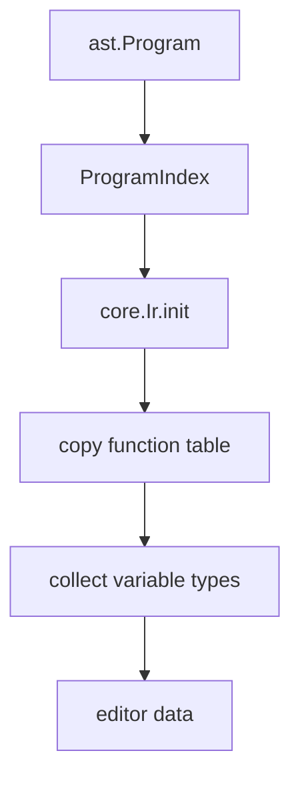

# Analysis and types

Analysis runs before user code is evaluated. It resolves names, loads imports, builds function tables, checks types, records dependencies, and prepares editor data. The implementation is split between `src/analysis` and `src/language`. Authoring syntax is documented in [Syntax](../authoring/syntax), and source-level types are documented in [Values and types](../authoring/values-and-types).

## Main files

| File | Responsibility |
| --- | --- |
| `src/analysis/typecheck.zig` | `ProgramIndex`, initial IR construction, typecheck entrypoint |
| `src/analysis/types.zig` | Type information and type acceptance |
| `src/analysis/infer.zig` | Expression type inference |
| `src/analysis/check.zig` | Statement and function-body checks |
| `src/analysis/calls.zig` | Function call validation |
| `src/analysis/contracts.zig` | Built-in and standard-function contracts |
| `src/analysis/dependencies.zig` | Read/write summaries for scheduling |
| `src/analysis/editor.zig` | Definitions, inlay hints, and editor data |
| `src/language/registry.zig` | Primitive functions, queries, and transforms |
| `src/language/names.zig` | Role, payload, and anchor name parsing |

## ProgramIndex

After module loading, `ProgramIndex` gathers modules and function declarations.

```zig
pub const ProgramIndex = struct {
    modules: std.ArrayList(core.SourceModule),
    module_order: std.ArrayList(core.SourceModuleId),
    functions: std.StringHashMap(ast.FunctionDecl),
    function_metadata: std.StringHashMap(core.FunctionMetadata),
    project_import_ids: std.ArrayList(core.SourceModuleId),
};
```

Project functions and imported standard-library functions share the same lookup table. `function_metadata` records ownership and source-module data for diagnostics and editor features.

## Initial IR

`typecheck.buildIr` creates an initial `core.Ir` from the AST and `ProgramIndex`. At this point the IR has modules, function tables, variable types, definitions, inlay hints, diagnostics, and the document node. Pages and objects are created later during elaboration.



## Type units

The runtime value category is `SemanticSort`.

```zig
pub const SemanticSort = enum {
    code,
    document,
    page,
    object,
    metadata,
    selection,
    anchor,
    function,
    style,
    string,
    number,
    boolean,
    constraints,
    fragment,
    void,
};
```

Source `bool` is normalized to internal `boolean`. Object class information is carried as auxiliary type information and is inferred from roles and object declarations.

## Checked conditions

| Target | Check |
| --- | --- |
| Function declaration | Parameter types, return type, body returns |
| Constant | Annotated type and right-hand expression |
| Function call | Name, arity, argument types, result type |
| Property assignment | Target type and accepted value domain |
| Constraint | Target object and valid anchors |
| `if` | Boolean condition |
| Lambda | Parameter and result types |
| Document statement | Page-only calls are rejected outside page context |

Some failures are detected later. Current-page availability, selection contents, asset existence, layout conflicts, and renderer failures are handled by elaboration, layout, and rendering.

## Function contracts

Built-ins and selected standard functions are checked through contracts. A contract describes parameter sorts, result sort, effects, and context requirements.

```text
name
parameters
result sort
effects
context requirements
```

Operator notation uses the same contracts as the corresponding function call. `10 + 4` is checked as `add(10, 4)`. `"a" ++ "b"` is checked as `concat("a", "b")`.

## Dependencies

`src/analysis/dependencies.zig` records resources read and written by pages and document statements.

```zig
pub const ResourceKind = enum {
    graph_pages,
    graph_objects,
    property,
    content,
    metadata,
    constraints,
    render_env,
    diagnostics,
    layout,
    asset,
};
```

The elaboration scheduler uses these summaries to order document statements after page bodies when those statements read page objects.

## Verification

```sh
zig build test
zig build run -- check demo/01-language-tour.ss
zig build run -- dump demo/01-language-tour.ss .ss-cache/analysis.json
```

Contract or type changes usually need tests under `tests/compiler_semantics_spec_tests.zig` and `tests/language_type_spec_tests.zig`.
