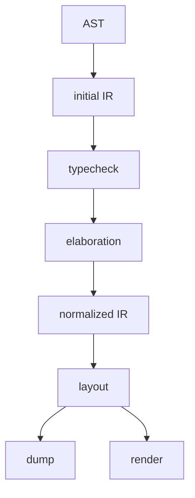

# Core IR

The core IR is the shared representation used after parsing and before rendering. The implementation is in `src/core/ir.zig` and `src/core/model.zig`. It stores modules, functions, document nodes, pages, objects, metadata, constraints, diagnostics, solved frames, and editor data.

## Position in the pipeline



The initial IR contains source modules, imported modules, function tables, type information, diagnostics, and the document node. After elaboration and lowering, it also contains pages, objects, metadata, constraints, and layout results.

## Ir structure

```zig
pub const Ir = struct {
    allocator: Allocator,
    asset_base_dir: []u8,
    modules: std.ArrayList(SourceModule),
    module_order: std.ArrayList(SourceModuleId),
    project_module_id: SourceModuleId,
    functions: std.StringHashMap(ast.FunctionDecl),
    function_metadata: std.StringHashMap(FunctionMetadata),
    variable_types: std.StringHashMap(SemanticSort),
    definitions: std.ArrayList(Definition),
    hints: std.ArrayList(InlayHint),
    nodes: std.ArrayList(Node),
    metadata: std.ArrayList(Metadata),
    page_order: std.ArrayList(NodeId),
    contains: std.AutoHashMap(NodeId, std.ArrayList(NodeId)),
    constraints: std.ArrayList(Constraint),
    diagnostics: std.ArrayList(Diagnostic),
    constraint_failures: std.ArrayList(ConstraintFailure),
    fragments: std.ArrayList(*Fragment),
};
```

| Field | Meaning |
| --- | --- |
| `asset_base_dir` | Base directory for asset paths |
| `modules` | Project and imported modules |
| `functions` | User and standard-library functions |
| `variable_types` | Type information collected by analysis |
| `definitions` | Editor definition locations |
| `hints` | Editor inlay hints |
| `nodes` | Document, page, and object nodes |
| `metadata` | Metadata used by generated content |
| `page_order` | Page sequence |
| `contains` | Parent-child edges |
| `constraints` | Layout constraints |
| `diagnostics` | Type, validation, layout, and render diagnostics |
| `fragments` | Internal fragment values |

## Nodes

`Node` represents documents, pages, and objects.

```zig
pub const Node = struct {
    id: NodeId,
    kind: NodeKind,
    name: []const u8,
    attached: bool,
    role: ?Role,
    object_kind: ?ObjectKind,
    payload_kind: ?PayloadKind,
    content: ?[]const u8,
    page_index: ?usize,
    origin: ?[]const u8,
    properties: std.ArrayList(Property),
    render_env: std.ArrayList(RenderEnvEntry),
    frame: Frame,
};
```

| Field | Used by | Meaning |
| --- | --- | --- |
| `kind` | all nodes | `document`, `page`, or `object` |
| `role` | object | `title`, `body`, `footer`, and related roles |
| `object_kind` | object | High-level object category |
| `payload_kind` | object | How `content` is interpreted |
| `content` | object, metadata | Text, code, math, or asset path |
| `origin` | page, object | Source location |
| `properties` | object | Renderer and layout properties |
| `frame` | object | Solved rectangle after layout |

## Kinds

```zig
pub const NodeKind = enum {
    document,
    page,
    object,
};

pub const ObjectKind = enum {
    text,
    overlay,
    asset,
};

pub const PayloadKind = enum {
    text,
    code,
    math_tex,
    image_ref,
    pdf_ref,
    none,
};
```

`role` and `payload_kind` are separate. A `title` role object and a `body` role object can both have text payloads. The role controls lookup and generation. The payload controls rendering.

## Properties

Properties are stored as name-value pairs on nodes. User code can assign strings, numbers, booleans, and styles where the field declaration permits them. The core IR stores renderer-readable string forms.

```zig
pub const Property = struct {
    key: []const u8,
    value: []const u8,
};
```

Property validation is handled during analysis and elaboration. Renderer interpretation is handled in `src/render` and `src/core/render_policy.zig`.

## Constraints and frames

Constraints refer to a target node anchor and a source anchor.

```zig
pub const Constraint = struct {
    target_node: NodeId,
    target_anchor: Anchor,
    source: ConstraintSource,
    offset: f32,
    origin: ?[]const u8,
};
```

The layout solver writes the solved frame to each object node.

```zig
pub const Frame = struct {
    x: f32,
    y: f32,
    width: f32,
    height: f32,
    x_set: bool,
    y_set: bool,
};
```

## Dump inspection

```sh
ss dump slide.ss .ss-cache/ir.json
```

Inspect `nodes`, `page_order`, `contains`, `constraints`, `metadata`, and `diagnostics` when debugging lowering, layout, rendering, or editor data.
