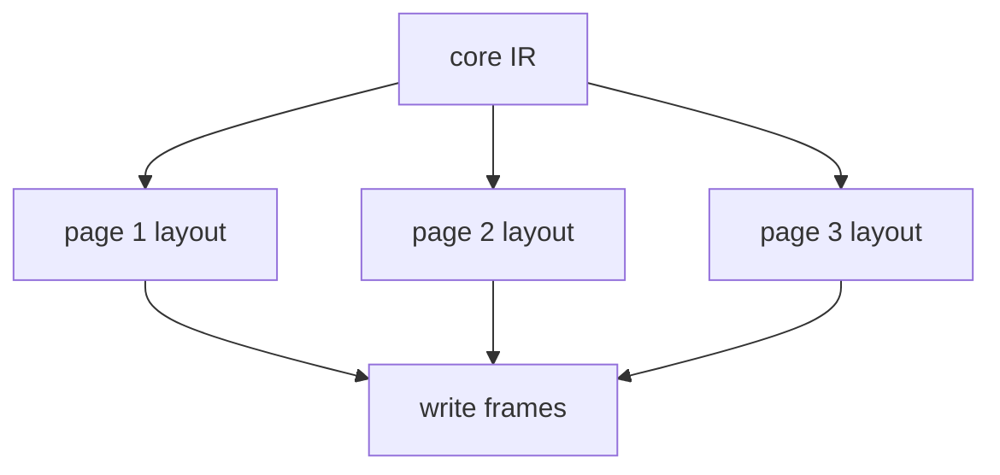

# Incremental and parallel work

The current implementation processes a document as one pipeline, but several boundaries already support later incremental or parallel work. The relevant boundaries are modules, functions, scheduled elaboration units, pages, layout, assets, and render cache entries.

## Current units

| Unit | Implementation | Parallel boundary |
| --- | --- | --- |
| Module loading | `src/modules` | Import graph controls order |
| Function collection | `src/analysis/typecheck.zig` | Module-level work |
| Type checking | `src/analysis` | Functions and pages can become units |
| Elaboration units | `ScheduledUnit` | Units without dependency edges |
| Page layout | `src/layout` | Usually page-local |
| PDF rendering | `src/render` | Page-level or asset-level work |

These units are not all executed in parallel today. They define places where ownership, IDs, caches, and diagnostics can be separated.

## Dependency resources

Before elaboration, `src/analysis/dependencies.zig` records resources read and written by page bodies and document statements.

```zig
pub const ResourceKind = enum {
    graph_pages,
    graph_objects,
    property,
    content,
    metadata,
    constraints,
    render_env,
    diagnostics,
    layout,
    asset,
};
```

When one unit writes a resource and another unit reads it, the scheduler fixes their order.

## Elaboration schedule

`ScheduleGraph` stores units, dependency edges, and the chosen order.

```zig
const ScheduleGraph = struct {
    document: doc.Document,
    units: std.ArrayList(ScheduledUnit),
    edges: std.ArrayList(ScheduleEdge),
    order: []usize,
};
```

The current evaluator uses topological order and executes units sequentially. Parallel execution would need stable ID allocation, isolated mutation of document state, deterministic diagnostics, and explicit ownership of temporary values.

## Page layout

Layout is naturally page-local after elaboration has produced the final page set.



Page numbers, total page count, tables of contents, and footers are handled before layout during elaboration. Layout parallelization assumes that generated pages and generated objects have already been fixed.

## Assets and rendering

Images, PDFs, math, and Font Awesome icons can use external commands and cache files. These operations are often independent by object, but shared cache paths and temporary filenames must be managed explicitly.

```text
.ss-cache/render
  asset cache
  math cache
  pdf page cache
```

Stable cache keys should be derived from input content and render settings.

## Incremental invalidation

| Change | Likely affected work |
| --- | --- |
| Page body text | That page's elaboration, layout, and render |
| Theme font size | Layout and render for many pages |
| Generated-content function | Document statement and generated objects |
| Imported function | Call sites in pages and document statements |
| Asset file | Referencing object layout estimate and render |
| Renderer code | Render output |

The current implementation does not persist this invalidation graph. Module indexes, dependency resources, and page-local layout are the existing data sources for future work.

## Risks

| Area | Constraint |
| --- | --- |
| ID allocation | Output must stay deterministic |
| Diagnostic order | Repeated runs should present diagnostics in stable order |
| Document statements | Page and metadata reads require explicit ordering |
| Allocation | Ownership and deinit must be clear per unit |
| Cache writes | Two workers must not write the same file concurrently |
| External commands | Temporary paths and environment variables must be separated |

## Verification

```sh
zig build test
zig build run -- dump demo/03-refs-and-generated.ss .ss-cache/incremental.json
zig build run -- render demo/03-refs-and-generated.ss .ss-cache/incremental.pdf
```

Inspect dependency summaries when changing document scheduling, selection queries, generated content, or page-local layout boundaries.
