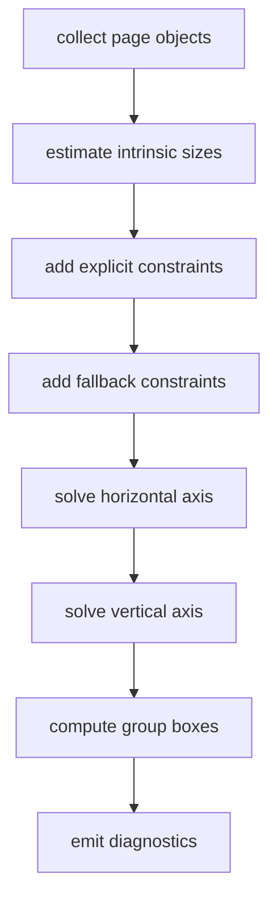

# Layout solver

The layout solver reads objects and constraints from the normalized core IR and writes a frame for each object. The implementation is under `src/layout`. User-facing layout syntax is documented in [Layout](../layout/default) and [Constraints](../authoring/constraints).

## Main files

| File | Responsibility |
| --- | --- |
| `src/layout/root.zig` | Page-level layout entrypoint |
| `src/layout/graph.zig` | Layout graph, axis state, constraints, tolerance constants |
| `src/layout/solver.zig` | Horizontal and vertical axis solving |
| `src/layout/fallback.zig` | Default placement when explicit constraints are missing |
| `src/layout/groups.zig` | Group bounding boxes and child translation |
| `src/layout/metrics.zig` | Text, code, image, PDF, and math estimates |
| `src/layout/style.zig` | Property readers for dimensions and colors |
| `src/layout/diagnostics.zig` | Overflow and unresolved-frame diagnostics |

## Input and output

| Item | Content |
| --- | --- |
| Input | Normalized `core.Ir` |
| Main input fields | `nodes`, `contains`, `constraints`, `properties`, `content` |
| Output | Object `frame` values |
| Diagnostics | Constraint conflict, negative size, unresolved frame, page overflow, content overflow |

Layout is page-local. The current model has no cross-page layout graph.

## Graph model

Each object has a horizontal axis and a vertical axis.

```text
horizontal: left, right, center_x, width
vertical:   top, bottom, center_y, height
```

Constraints are equations between anchors. The solver combines explicit constraints, estimated sizes, and fallback placement.

## Flow



Intrinsic sizes depend on payload, content, and properties. The estimate is used for stable layout. Final rendering still happens in the PDF backend.

## Constraint meaning

```ss
~ body.top == title.bottom - 32
```

The target anchor is `body.top`. The source anchor is `title.bottom`. The offset is `-32`. Standard helpers such as `below`, `same_l`, and `pin_l` build these low-level constraints.

## Fallback placement

Fallback placement fills missing layout information. It uses page layout policy and object layout properties.

| Case | Fallback |
| --- | --- |
| Normal page object | Place in vertical order |
| Text width missing | Use page width and insets |
| Text height missing | Estimate from text metrics |
| Asset size missing | Estimate from asset size and scale |
| Overlay size missing | Use target object or chrome properties |

Explicit constraints take priority. Contradictions become diagnostics.

## Groups

`group(a, b, ...)` creates an object whose frame is the bounding box of its children. When a group is moved, child objects are translated by the same delta.

```ss
let a = text("A")
let b = text("B")
below(b, a, 18)
let g = group(a, b)
pin_l(g, 72)
```

The group node has the `group` role and overlay object kind.

## Diagnostics

| Diagnostic | Meaning |
| --- | --- |
| `ConstraintConflict` | Equations on the same axis contradict each other |
| `NegativeConstraintSize` | Left/right or top/bottom imply a negative size |
| `unresolved_frame` | Position or size remains unknown |
| `page_overflow` | Object leaves the page |
| `content_overflow` | Content needs more space than the frame |

## Verification

```sh
zig build test
zig build run -- render demo/02-layout-graph.ss .ss-cache/layout-solver.pdf
zig build run -- dump demo/02-layout-graph.ss .ss-cache/layout-solver.json
```

Inspect target anchors, source anchors, offsets, and solved frames in the dump output.
