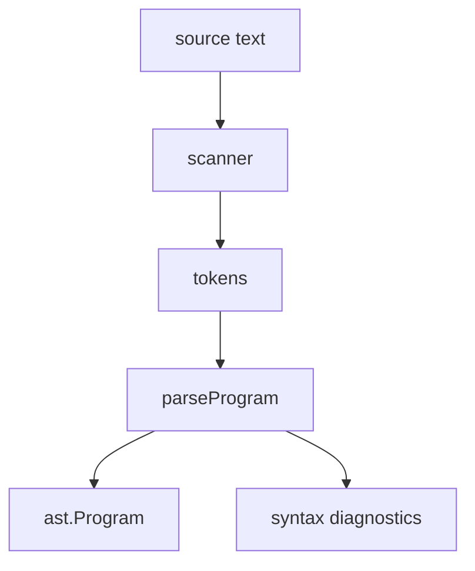

# Parser

The parser builds an AST from `.ss` source text. The implementation lives in `src/syntax/scanner.zig`, `src/syntax/parse.zig`, and `src/syntax/diagnostics.zig`. AST definitions are in `src/ast.zig`. User-facing syntax is documented in [Syntax](../authoring/syntax).

## Entrypoints

```zig
pub fn parse(allocator: Allocator, source: []const u8) !Program
pub fn parseWithSourceName(allocator: Allocator, source: []const u8, source_name: []const u8) !Program
```

The CLI calls these through `parseSource` in `src/app.zig`. Syntax failures produce diagnostics with source positions and are surfaced as `DiagnosticsFailed`.

## Flow



The scanner splits text into tokens. The parser reads tokens and builds imports, type declarations, object declarations, constants, functions, document statements, pages, expressions, and constraints.

## Program

`ast.Program` stores top-level source structure.

```zig
pub const Program = struct {
    imports: std.ArrayList(ImportDecl),
    functions: std.ArrayList(FunctionDecl),
    constants: std.ArrayList(FunctionDecl),
    pages: std.ArrayList(PageDecl),
    document_statements: std.ArrayList(Statement),
    top_level_items: std.ArrayList(TopLevelItem),
};
```

`top_level_items` preserves source order for imports and pages. Later stages use that order when loading modules and evaluating page blocks.

## Top-level forms

| Source form | AST node | Use |
| --- | --- | --- |
| `import` | `ImportDecl` | Module reference |
| `const` | `FunctionDecl` | Constant represented as a zero-argument function |
| `fn` | `FunctionDecl` | Function declaration |
| `type` | `TypeItem` | Type alias or object class declaration |
| `object` | `ObjectDecl` | Object class and fields |
| `extend object` | `ObjectExtensionDecl` | Object class extension |
| `document` | `document_statements` | Whole-document statements |
| `page` | `PageDecl` | Page body |

## Expressions

Expression parsing is split by precedence.

```text
parseExpr
  parseConcatExpr
    parseAddSubExpr
      parseMulDivExpr
        parseUnaryExpr
          parsePostfixExpr
            parsePrimaryExpr
```

| Parser function | Syntax |
| --- | --- |
| `parseConcatExpr` | `++` |
| `parseAddSubExpr` | `+`, `-` |
| `parseMulDivExpr` | `*`, `/` |
| `parseUnaryExpr` | Unary `-` |
| `parsePostfixExpr` | Calls and property access |
| `parsePrimaryExpr` | Identifiers, strings, numbers, booleans, lambdas, parenthesized expressions |

Operator syntax is lowered to ordinary built-in calls during parsing. `a + b` has the same call shape as `add(a, b)`. `a ++ b` has the same call shape as `concat(a, b)`.

## Strings

The parser accepts quoted strings, line text, and chevron block strings.

```ss
text("one line")
text <<
multiple lines
>>
```

Markdown interpretation is not part of parsing. Markdown-like body text is handled by the core model and renderer.

## Constraints and types

Constraint statements start with `~` and are parsed into target anchor, source anchor, and offset.

```ss
~ body.top == title.bottom - 32
```

Type annotations are read by `parseTypeAnnotation`. The public source-level forms are documented in [Values and types](../authoring/values-and-types).

## Verification

```sh
zig build test
zig build run -- check demo/01-language-tour.ss
```

Parser changes should include syntax tests under `tests/syntax_spec_tests.zig` when they change accepted source forms.
