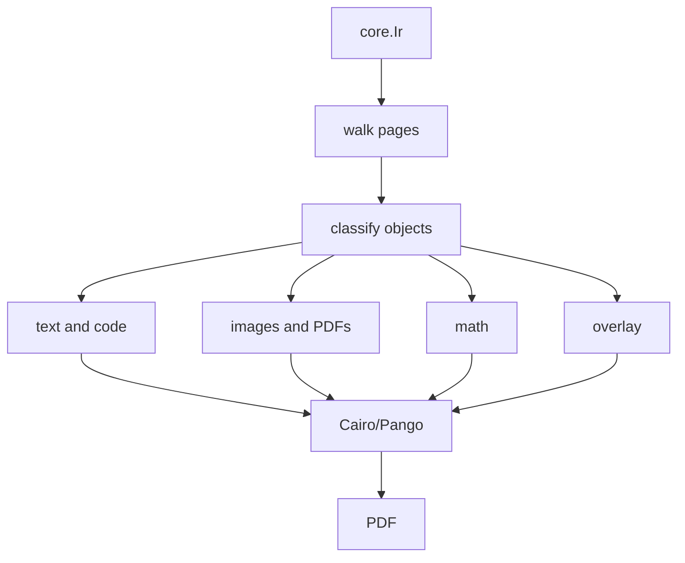

# PDF backend

The PDF backend reads solved core IR and writes a PDF. The main files are `src/render/pdf.zig`, `src/render/pdf_native.zig`, and the Cairo/Pango bridge in `src/render/pdf_native_c.c`. External tools are documented in [External tools](../rendering/external-tools).

## Input

The backend receives a solved `core.Ir`. User functions are not re-run during rendering. The renderer reads page order, objects, frames, content, payload kinds, properties, render environment, and `asset_base_dir`.



## Render categories

| Object data | Render path |
| --- | --- |
| Text payload | Markdown and Pango text drawing |
| Code payload | Syntax highlighting and monospaced text |
| Math payload | LaTeX conversion and vector drawing |
| Image payload | Asset resolution and image drawing |
| PDF payload | PDF page conversion and placement |
| Overlay object | Rectangles, fills, strokes, rules, and chrome |
| Font Awesome reference | Icon lookup and vector drawing |

Font Awesome details are in [Font Awesome](../rendering/fontawesome). Math details are in [Math](../rendering/math). Asset details are in [Assets](../rendering/assets).

## Properties

Renderer properties are stored as strings in core IR and parsed by the backend.

| Property | Use |
| --- | --- |
| `text_size` | Text size |
| `text_line_height` | Line height |
| `text_color` | Text color |
| `chrome_fill` | Background fill |
| `chrome_stroke` | Stroke color |
| `chrome_line_width` | Stroke width |
| `asset_scale` | Asset scale |
| `render_kind` | Special render path |

User code may assign numbers and booleans where field declarations permit them. Elaboration converts those values into renderer-readable forms.

## External tools

| Use | Tool |
| --- | --- |
| SVG conversion | `rsvg-convert` |
| PDF page rasterization | `pdftoppm` |
| Image conversion | `magick` |
| LaTeX math | `pdflatex` |
| PDF normalization | `qpdf` |

`ss check` does not run the PDF backend. Missing tools and render-time conversion failures are found by `ss render`.

## Assets

Asset paths are resolved from `asset_base_dir`.

```ss
image("assets/plot.png", 0.8)
pdf("assets/report.pdf", 1, 0.7)
```

The backend reads asset dimensions and places the result inside the solved frame. A large mismatch between layout estimates and rendered content can cause overlap or overflow diagnostics.

## Text

Text and headings are drawn through Pango. Markdown parsing is handled before final drawing, then the backend combines text properties, inline spans, links, inline code, math, emoji, and font fallback.

Emoji and icon spacing depends on glyph extents and fallback fonts. Changes in this area should be checked with a sample containing adjacent emoji, Japanese text, Latin text, and Font Awesome icons.

## Diagnostics

| Cause | Example |
| --- | --- |
| Missing asset | Image or PDF path not found |
| Invalid asset | Unreadable image or broken PDF |
| External command failure | `pdflatex` or `pdftoppm` failure |
| Content overflow | Text or code exceeds the frame |
| Font Awesome lookup failure | Unknown icon name or prefix |

## Verification

```sh
zig build run -- render demo/seminar-05-12.ss .ss-cache/pdf-backend.pdf
```

For changes to Font Awesome, emoji, code highlighting, PDF embedding, math, or image conversion, render a sample that contains that object kind and inspect the generated PDF.
