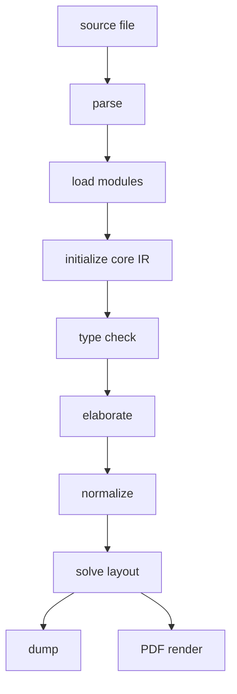

# Compiler pipeline

The CLI entrypoint is `src/main.zig`. The high-level pipeline is `src/app.zig`. `check`, `dump`, and `render` all pass through the same build path. `render` then calls the PDF backend.

| Command | Main use | Reached implementation |
| --- | --- | --- |
| `ss check input.ss` | Syntax, import, type, elaboration, and layout diagnostics | `app.buildFile` |
| `ss dump input.ss out.json` | Inspect core IR, pages, objects, constraints, and diagnostics | `app.buildFile`, then dump |
| `ss render input.ss out.pdf` | Write a PDF | `app.buildFile`, then `render/pdf.zig` |

`check` does not call the renderer. External commands, image conversion, PDF embedding, and Font Awesome conversion are tested by `render`.

## Flow

The current implementation uses the following order.



| Stage | Implementation | Input | Output |
| --- | --- | --- | --- |
| Source read | `src/app.zig` | File path and asset base | Source text |
| Parse | `src/syntax` | Source text | `ast.Program` |
| Module loading | `src/modules`, `src/analysis/typecheck.zig` | Imports, standard library, project files | `ProgramIndex` |
| Initial IR | `src/analysis/typecheck.zig` | AST and modules | `core.Ir` |
| Type checking | `src/analysis` | `core.Ir` and AST | Diagnostics, type metadata, editor metadata |
| Elaboration | `src/elaboration` | Checked IR | `elaboration.Document` |
| Normalization | `src/lowering` | `elaboration.Document` | Pages, nodes, and constraints in `core.Ir` |
| Layout | `src/core/ir.zig`, `src/layout` | `core.Ir` | Solved rectangles and layout diagnostics |
| Render | `src/render` | Solved IR | PDF |

## `app.buildFile`

`buildFileWithAssetBaseAndOverlay` in `src/app.zig` is the central function.

```text
read source
parseSource
loadProgramIndexWithOverlay
typecheck.buildIr
typecheck.typecheckProgram
lowering.lowerToIr
print diagnostics
return core.Ir
```

When a progress reporter is passed, the user-visible steps are `Read source`, `Parse`, `Load index`, `Typecheck`, and `Lower and solve`. Internally, `Lower and solve` includes elaboration, normalization, `ir.finalize`, layout solving, and editor frame hint refresh.

## Representations

Each stage changes the data representation.

| Representation | Main structure | Role |
| --- | --- | --- |
| Source | `[]const u8` | Text and source locations |
| AST | `ast.Program` | Imports, declarations, functions, constants, pages, document block |
| Program index | `ProgramIndex` | Resolved imports, function table, function module ownership |
| Initial IR | `core.Ir` | Modules, functions, definition locations, type data, document node |
| Elaboration document | `elaboration.Document` | Pages, nodes, metadata, constraints, operation terms |
| Core IR | `core.Ir` | Shared graph used by dump, layout, render, and editor features |
| Layout graph | `layout.LayoutGraph` | Page-local axes, constraints, fallback placement |

`elaboration.Document` is temporary. `core.Ir` is the graph shared after loading and through rendering.

## Diagnostics

Diagnostics are produced at several stages.

| Stage | Examples | Output |
| --- | --- | --- |
| Parser | Unclosed string, unknown token | Source-positioned parse error |
| Import resolution | Missing `std:` module, import cycle | Loader report |
| Type checking | Type mismatch, unknown function, wrong return value | `core.Ir.diagnostics` |
| Elaboration | Page operation outside a page, invalid selection mutation | Diagnostic with source origin |
| Normalization | Unknown handle, failed constraint mapping | IR diagnostic or internal error |
| Layout | Constraint conflict, negative size, overflow | Constraint failure and diagnostics |
| Render | Asset failure, external command failure | Renderer diagnostic or command failure |

`app.buildFile` checks diagnostics after type checking and after normalization. If errors exist, it returns `DiagnosticsFailed`.

## Imports and Standard Library

Imports such as `std:themes/default` are resolved by the module loader. Project files, `stdlib/core`, and `stdlib/themes` enter the same AST and function tables.

```ss
import std:themes/default

page intro
  head("Title")
  text("Body")
end
```

`head` and `text` are ordinary functions resolved from the imported theme. During page execution, standard library functions add objects to the current page.

## Local Checks

Use separate commands for the main inspection targets.

```sh
zig build run -- check demo/seminar-05-12.ss
zig build run -- dump demo/seminar-05-12.ss .ss-cache/dev-dump.json
zig build run -- render demo/seminar-05-12.ss .ss-cache/dev-render.pdf
```

After changing the standard library, check the library files.

```sh
for f in stdlib/core/*.ss stdlib/themes/*.ss; do
  zig-out/bin/ss check "$f"
done
```

Generated JSON, PDFs, and preview images should be placed under `.ss-cache/`.

## Choosing the Code Area

Syntax changes usually start in `src/syntax` and `src/analysis`. Type and function contract changes usually start in `src/language` and `src/analysis`. Execution behavior starts in `src/elaboration`. Mapping from elaboration output to renderable graph starts in `src/lowering`.

Presentation components, themes, layout helpers, and render properties should be expressed in `stdlib/` when the existing kernel supports them.

## References

- [Parser](./parser)
- [Analysis and types](./analysis)
- [Elaboration](./elaboration)
- [Lowering](./lowering)
- [Core IR](./core-ir)
- [Layout solver](./layout-solver)
