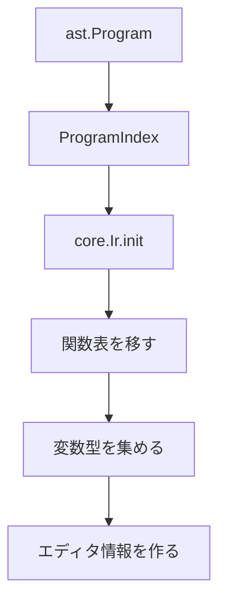

# 解析と型

解析は，AST をそのまま実行する前に，名前，型，関数契約，依存関係，エディタ用情報をそろえる段階です．実装は `src/analysis` と `src/language` にあります．利用者向けの型一覧は [値と型](../authoring/values-and-types)，関数の書き方は [関数と定義](../authoring/functions) を参照してください．

## 主なファイル

| ファイル | 担当 |
| --- | --- |
| `src/analysis/typecheck.zig` | ProgramIndex，IR 初期化，型検査の入口 |
| `src/analysis/types.zig` | 型表現と型一致 |
| `src/analysis/infer.zig` | 式の型推論 |
| `src/analysis/check.zig` | 文や関数の検査 |
| `src/analysis/calls.zig` | 関数呼び出しの検査 |
| `src/analysis/contracts.zig` | 組み込み関数や標準関数の契約 |
| `src/analysis/dependencies.zig` | 展開スケジュール用の読み書き解析 |
| `src/analysis/editor.zig` | 定義ジャンプ，インレイヒント |
| `src/language/registry.zig` | プリミティブ関数，クエリ，変換の登録 |
| `src/language/names.zig` | ロール，ペイロード種別，アンカー名の解析 |

## ProgramIndex

モジュール読み込み後は `ProgramIndex` に関数表やモジュール情報を集めます．

```zig
pub const ProgramIndex = struct {
    modules: std.ArrayList(core.SourceModule),
    module_order: std.ArrayList(core.SourceModuleId),
    functions: std.StringHashMap(ast.FunctionDecl),
    function_metadata: std.StringHashMap(core.FunctionMetadata),
    project_import_ids: std.ArrayList(core.SourceModuleId),
};
```

`functions` は，プロジェクトと import 済み標準ライブラリの関数を同じ表に入れます．関数名が重なる場合の扱いは，読み込み順と登録処理に依存します．関数の所属モジュールは `function_metadata` で追います．

## 初期 IR

`typecheck.buildIr` は，AST と `ProgramIndex` から `core.Ir` を作ります．この時点の IR には，モジュール，関数表，変数型，定義位置，インレイヒント，document ノードが入ります．ページや object はまだ展開されていません．



## 型の単位

処理系で扱う値分類は `SemanticSort` です．

```zig
pub const SemanticSort = enum {
    code,
    document,
    page,
    object,
    metadata,
    selection,
    anchor,
    function,
    style,
    string,
    number,
    boolean,
    constraints,
    fragment,
    void,
};
```

表層構文の `bool` は内部では `boolean` に寄せます．object クラスは，型表現側の補助情報として扱います．利用者向けの型注釈は [値と型](../authoring/values-and-types) にまとめています．

## 型検査で見ること

型検査は，次の条件を確認します．

| 対象 | 確認すること |
| --- | --- |
| 関数宣言 | 引数型，返り値型，本体の `return` |
| 定数 | 右辺の型と注釈 |
| 関数呼び出し | 関数名，引数数，引数型，返り値 |
| プロパティ代入 | 左辺が object か，右辺が受け付け可能な値か |
| 制約 | target が object か，アンカーが妥当か |
| `if` | 条件が `boolean` か |
| ラムダ式 | 引数型と返り値 |
| document 文 | ページ外で許可される操作か |

型検査はすべての実行時条件を検出するものではありません．現在ページの有無，選択の内容，アセットの実体，配置衝突などは，展開，配置，描画で確認します．

## 関数契約

組み込み関数と標準関数は，関数契約を通じて型検査されます．契約は，引数の型，返り値の型，副作用の種類，実行文脈の制限を持ちます．

```text
name
parameters
result sort
effects
context requirements
```

例として，`add` は `number` と `number` を受け取り `number` を返します．`concat` は `string` と `string` を受け取り `string` を返します．`new` や `set_prop` は文書グラフを変更します．

```ss
let size = 18 + 4
let label = "page " ++ str(page_index(pagectx()))
```

演算子表記で書いた式も，解析では対応する組み込み関数の呼び出しとして扱います．`10 + 4` は `add(10, 4)` と同じ引数検査を受けます．演算子として書ける関数の一覧は [演算子と組み込み関数](../authoring/operators-and-builtins) を参照してください．

## 依存関係解析

`src/analysis/dependencies.zig` は，展開スケジューラのために，各文やページが読む資源と書く資源を集めます．

```zig
pub const ResourceKind = enum {
    graph_pages,
    graph_objects,
    property,
    content,
    metadata,
    constraints,
    render_env,
    diagnostics,
    layout,
    asset,
};
```

この情報は型検査の結果とは別に，展開の実行順序へ使います．ページ本体が作る object を document 文が読む場合，ページ本体を先に実行するための辺を作ります．詳しくは [展開](./elaboration) を参照してください．

## 診断

診断は `core.Ir.diagnostics` に入ります．型検査では，型不一致，未知の関数，不正な返り値，再帰関数などを報告します．

```zig
pub const Diagnostic = struct {
    phase: DiagnosticPhase,
    severity: DiagnosticSeverity,
    page_id: ?NodeId,
    node_id: ?NodeId,
    origin: ?[]const u8,
    data: Data,
};
```

型不一致は，期待する `SemanticSort` と実際の `SemanticSort` を持ちます．エラー表示では，`origin` を使ってソース位置を示します．

## エディタ情報

解析段階では，定義位置とインレイヒントも作ります．

| 情報 | 用途 |
| --- | --- |
| `Definition` | 関数，変数，ページ，object への定義ジャンプ |
| `InlayHint` | 引数名，配置後の矩形など |
| `variable_types` | エディタ上の型表示，検査補助 |

配置後の矩形ヒントは，正規化と配置解決の後に `editor.refreshSolvedFrameHints` で更新します．

## 実行例

次の例は，型検査で止まります．

```ss
import std:themes/default

page bad
let body = text("本文")
body.text_size = "large"
below(body, 12, 32)
end
```

`body.text_size = "large"` はプロパティとしては文字列を受け付けるため，この段階だけでは意味上の不正とは限りません．`below(body, 12, 32)` は `object` が必要な場所へ `number` を渡しているため，型検査で診断になります．

## 変更時の確認

解析や型を変えた場合は，標準ライブラリと代表サンプルを確認します．

```sh
zig build test
zig build run -- check demo/seminar-05-12.ss
for f in stdlib/core/*.ss stdlib/themes/*.ss; do
  zig-out/bin/ss check "$f"
done
```

型名，関数契約，プリミティブ関数，プロパティ代入の受理規則を変えた場合は，利用者向けの [値と型](../authoring/values-and-types)，[関数と定義](../authoring/functions)，[演算子と組み込み関数](../authoring/operators-and-builtins) も更新します．
