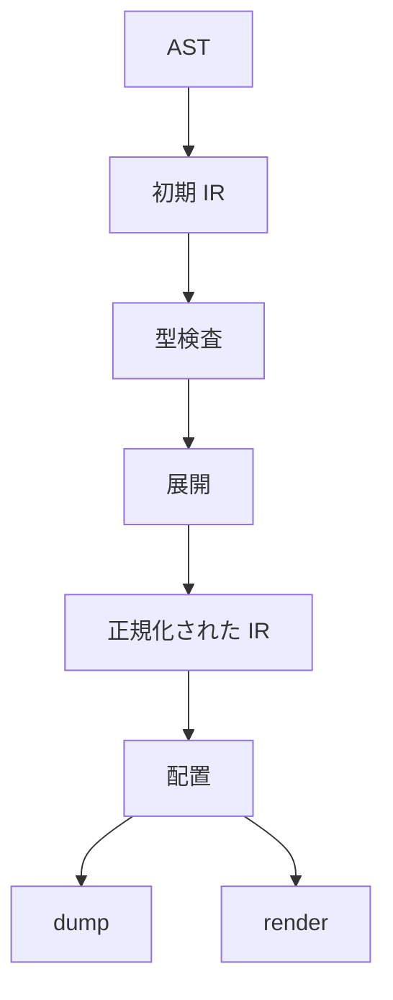

# 中核 IR

中核 IR は，`ss` の解析後から描画まで共有される内部表現です．実装は `src/core/ir.zig` と `src/core/model.zig` にあります．ページ，object，メタデータ，制約，診断，配置後の矩形，エディタ用情報を保持します．

## 位置付け

中核 IR には二つの用途があります．一つ目は，構文解析と型検査の結果を保持することです．二つ目は，展開，正規化，配置，描画の共通入力になることです．



初期 IR には，プロジェクトモジュール，import されたモジュール，関数表，型情報，診断，文書ノードが入ります．正規化後の IR には，ページ，object，メタデータ，制約，配置結果も入ります．

## `Ir` の構造

`src/core/ir.zig` の `Ir` は，処理系の中心にある構造です．

```zig
pub const Ir = struct {
    allocator: Allocator,
    asset_base_dir: []u8,
    modules: std.ArrayList(SourceModule),
    module_order: std.ArrayList(SourceModuleId),
    project_module_id: SourceModuleId,
    functions: std.StringHashMap(ast.FunctionDecl),
    function_metadata: std.StringHashMap(FunctionMetadata),
    variable_types: std.StringHashMap(SemanticSort),
    definitions: std.ArrayList(Definition),
    hints: std.ArrayList(InlayHint),
    nodes: std.ArrayList(Node),
    metadata: std.ArrayList(Metadata),
    page_order: std.ArrayList(NodeId),
    contains: std.AutoHashMap(NodeId, std.ArrayList(NodeId)),
    constraints: std.ArrayList(Constraint),
    diagnostics: std.ArrayList(Diagnostic),
    constraint_failures: std.ArrayList(ConstraintFailure),
    fragments: std.ArrayList(*Fragment),
};
```

| フィールド | 説明 |
| --- | --- |
| `asset_base_dir` | アセット参照を解決する基準ディレクトリ |
| `modules` | プロジェクトと import 済みモジュール |
| `functions` | ユーザ関数と標準ライブラリ関数 |
| `function_metadata` | 関数の所属モジュールなど |
| `variable_types` | 解析時に得た変数の型 |
| `definitions` | エディタの定義ジャンプ用情報 |
| `hints` | エディタのインレイヒント |
| `nodes` | document，page，object |
| `metadata` | 目次や生成用のメタデータ |
| `page_order` | ページの順序 |
| `contains` | 親子関係 |
| `constraints` | 配置制約 |
| `diagnostics` | 型，検証，配置，描画の診断 |
| `fragments` | fragment の内部値 |

## ノード

`Node` は，document，page，object を同じ構造で表します．

```zig
pub const Node = struct {
    id: NodeId,
    kind: NodeKind,
    name: []const u8,
    attached: bool,
    role: ?Role,
    object_kind: ?ObjectKind,
    payload_kind: ?PayloadKind,
    content: ?[]const u8,
    page_index: ?usize,
    origin: ?[]const u8,
    properties: std.ArrayList(Property),
    render_env: std.ArrayList(RenderEnvEntry),
    frame: Frame,
};
```

| フィールド | 対象 | 説明 |
| --- | --- | --- |
| `id` | 全ノード | IR 内の識別子 |
| `kind` | 全ノード | `document`，`page`，`object` の分類 |
| `name` | 全ノード | ソース上の名前または生成名 |
| `attached` | page，object | 親子関係に接続されているか |
| `role` | object | `title`，`body`，`footer` などのロール |
| `object_kind` | object | 描画対象の大分類 |
| `payload_kind` | object | 内容の解釈方法 |
| `content` | object，metadata | 本文，コード，画像パスなど |
| `page_index` | page | 一始まりのページ番号 |
| `origin` | page，object | ソース位置 |
| `properties` | object | 描画器や配置が読むプロパティ |
| `render_env` | object | コードや描画用の環境設定 |
| `frame` | object | 配置後の矩形 |

`attached` が `false` の object は，作成されたがページの通常の親子関係に入っていない object です．group や fragment の処理では，この差を意識する必要があります．

## ノード種別

ノードの基本分類は三つです．

```zig
pub const NodeKind = enum {
    document,
    page,
    object,
};
```

`document` は文書全体を表す一つのノードです．`page` はページ順序を持ちます．`object` は描画対象です．ページの中に object が入り，group object の中に子 object が入る場合があります．

## object 種別

object の描画大分類は `ObjectKind` です．

```zig
pub const ObjectKind = enum {
    text,
    source,
    overlay,
    asset,
};
```

| 種別 | 説明 | 例 |
| --- | --- | --- |
| `text` | 文字として描画する | 本文，見出し，注釈 |
| `source` | コードや数式など，処理後に描画する | code，tex |
| `overlay` | 枠，背景，group など | border，panel，group |
| `asset` | 外部ファイルを参照する | image，pdf |

描画器は `object_kind` と `payload_kind` とプロパティを組み合わせて，実際の処理を選びます．

## ペイロード種別

`PayloadKind` は `content` の解釈方法です．

```zig
pub const PayloadKind = enum {
    text,
    code,
    math_text,
    math_tex,
    figure_text,
    image_ref,
    pdf_ref,
};
```

| 種別 | `content` の意味 |
| --- | --- |
| `text` | Markdown 風の本文 |
| `code` | シンタックスハイライト対象のコード |
| `math_text` | 簡易数式文字列 |
| `math_tex` | LaTeX 数式 |
| `figure_text` | 図注などの短い文字列 |
| `image_ref` | 画像ファイルへの参照 |
| `pdf_ref` | PDF ファイルへの参照 |

利用者向けには [オブジェクトとロール](../authoring/objects) で説明しています．描画器側では [PDF 描画器](./pdf-backend) を参照してください．

## プロパティ

中核 IR のプロパティは，キーと文字列値の組です．

```zig
pub const Property = struct {
    key: []const u8,
    value: []const u8,
};
```

これは保存形式です．ユーザが `.ss` で代入できる値は文字列だけではありません．展開時に，`string`，`number`，`boolean`，`style` がプロパティ用の文字列へ変換されます．

```ss
body.text_size = 22
body.wrap = true
body.theme = style("emphasis")
```

中核 IR では概念的に次のようになります．

```json
[
  { "key": "text_size", "value": "22" },
  { "key": "wrap", "value": "true" },
  { "key": "theme", "value": "emphasis" }
]
```

プロパティの意味を決めるのは，主に標準ライブラリ，配置，描画器です．IR 自体は，未知のプロパティ名を広く受け入れます．

## 親子関係

親子関係は `contains` に入ります．

```zig
contains: std.AutoHashMap(NodeId, std.ArrayList(NodeId))
```

典型的な構造は次の通りです．

```text
document
  page intro
    object title
    object body
    object group
      object child_a
      object child_b
```

ページ順序は `page_order` で管理します．親子関係だけを見てもページ順が分からないため，ページ順が必要な処理では `page_order` を使います．

## 制約

配置制約は `Constraint` です．

```zig
pub const Constraint = struct {
    target_node: NodeId,
    target_anchor: Anchor,
    source: ConstraintSource,
    offset: f32,
    origin: ?[]const u8,
};
```

`target_node` は制約で動かす object です．`target_anchor` はその object の `left`，`right`，`top`，`bottom`，`center_x`，`center_y` のどれかです．`source` はページアンカーまたは別 object のアンカーです．`offset` は基準からの差分です．

```ss
below(body, title, 32)
```

この呼び出しは，概念的には次の関係を作ります．

```text
body.top = title.bottom + 32
```

実装上の符号は helper 関数の定義に依存します．dump では `target_anchor`，`source`，`offset` を見て，どの辺を固定しているかを確認します．

## frame

配置後の矩形は `Frame` に入ります．

```zig
pub const Frame = struct {
    x: f32,
    y: f32,
    width: f32,
    height: f32,
    x_set: bool,
    y_set: bool,
};
```

`x` と `y` は左上基準です．`width` と `height` は描画器が object を置く範囲です．`x_set` と `y_set` は，配置解決で座標が確定したかを表します．未解決の場合は `unresolved_frame` 診断になります．

## 値と型

実行時の値分類は `SemanticSort` と `Value` に表れます．

```zig
pub const SemanticSort = enum {
    code,
    document,
    page,
    object,
    metadata,
    selection,
    anchor,
    function,
    style,
    string,
    number,
    boolean,
    constraints,
    fragment,
    void,
};
```

```zig
pub const Value = union(SemanticSort) {
    code: CodeValue,
    document: NodeId,
    page: NodeId,
    object: NodeId,
    metadata: MetadataId,
    selection: Selection,
    anchor: AnchorValue,
    function: FunctionRef,
    style: StyleRef,
    string: []const u8,
    number: f32,
    boolean: bool,
    constraints: ConstraintSet,
    fragment: *Fragment,
    void: void,
};
```

利用者向けの型一覧は [値と型](../authoring/values-and-types) を参照してください．処理系側では，`SemanticSort` が型検査，関数契約，展開時の値検査，診断表示で使われます．

## 選択

`selection` は，ページ，object，メタデータの集合です．

```zig
pub const Selection = struct {
    item_sort: SelectionItemSort,
    provenance: []const u8,
    ids: std.ArrayList(NodeId),
};
```

`SelectionItemSort` は `page`，`object`，`metadata` のどれかです．`provenance` は選択を作ったクエリ名です．診断やデバッグで，その選択がどこから来たかを追うために使います．

## メタデータ

メタデータは document または page に紐づく追加情報です．

```zig
pub const Metadata = struct {
    id: MetadataId,
    kind: []const u8,
    value: []const u8,
    page_id: ?NodeId,
    origin: ?[]const u8,
};
```

`page_id` が `null` の場合は文書全体のメタデータです．ページに紐づく場合は，目次，章，注釈などの生成処理で参照できます．

## 診断

中核 IR の診断は，段階，severity，対象ページ，対象ノード，ソース位置，データを持ちます．

```zig
pub const Diagnostic = struct {
    phase: DiagnosticPhase,
    severity: DiagnosticSeverity,
    page_id: ?NodeId,
    node_id: ?NodeId,
    origin: ?[]const u8,
    data: Data,
};
```

| フィールド | 説明 |
| --- | --- |
| `phase` | `layout`，`validation`，`render` |
| `severity` | `warning` または `error` |
| `page_id` | 関連するページ |
| `node_id` | 関連する object |
| `origin` | ソース位置 |
| `data` | 診断の種類ごとの詳細 |

診断データには，ユーザ報告，アセット不足，アセット不正，型不一致，再帰関数，未解決 frame，ページはみ出し，内容はみ出しがあります．

## dump で見る値

IR の確認には `dump` を使います．

```sh
ss dump slide.ss .ss-cache/ir.json
```

確認する順序は次が扱いやすいです．

| 項目 | 見ること |
| --- | --- |
| `nodes` | 期待したページと object があるか |
| `page_order` | ページ順が正しいか |
| `contains` | 親子関係が正しいか |
| `properties` | 文字サイズ，色，描画方式が入っているか |
| `constraints` | 対象と基準のアンカーが意図通りか |
| `frame` | 配置後の矩形が期待通りか |
| `diagnostics` | どの段階の診断か |

## 変更時の確認

IR の構造を変えた場合は，次を確認します．

```sh
zig build
zig build test
zig build run -- dump demo/seminar-05-12.ss .ss-cache/core-ir.json
zig build run -- render demo/seminar-05-12.ss .ss-cache/core-ir.pdf
```

`Node`，`Property`，`Constraint`，`Diagnostic` を変えた場合は，正規化，配置，描画，dump，エディタ機能に影響します．新しいフィールドを追加した場合は，所有権と deinit も確認します．

## 参照

- IR を作るまでの流れは [コンパイラの流れ](./pipeline) を参照してください．
- 実行時の文書状態は [展開](./elaboration) を参照してください．
- 展開文書から IR への写像は [正規化](./lowering) を参照してください．
- 配置後の frame は [配置ソルバ](./layout-solver) を参照してください．
