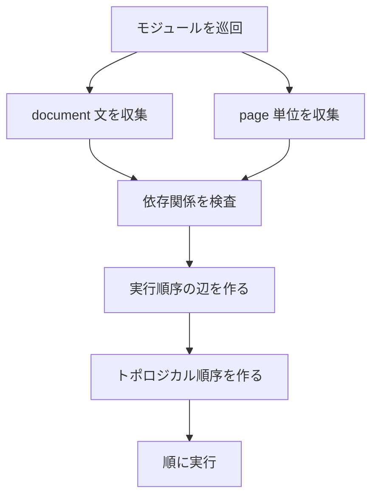

# 展開

展開は，型検査済みのプログラムを実行し，ページ，object，メタデータ，プロパティ，制約を持つ文書状態を作ります．実装は `src/elaboration/eval.zig`，`src/elaboration/document.zig`，`src/elaboration/builtin.zig` にあります．展開後の状態は [正規化](./lowering) で [中核 IR](./core-ir) に写されます．

## 入力と出力

| 項目 | 内容 |
| --- | --- |
| 入力 | 型検査済みの `core.Ir` |
| 出力 | `elaboration.Document` |
| 主な入口 | `elaboration.elaborateIr` |
| 実行対象 | `document` 文，`page` ブロック，標準ライブラリ関数，ユーザ関数 |
| 生成物 | ページ，object，メタデータ，プロパティ，render env，制約，診断，項列 |

展開は描画を行いません．文字の幅，画像の実寸，PDF のページ変換，Font Awesome の画像化は描画段階の処理です．展開が扱うのは，描画器が後で読む文書グラフの構造とプロパティです．

## 文書状態

`src/elaboration/document.zig` の `Document` は，展開中の文書グラフを保持します．

```zig
pub const Document = struct {
    asset_base_dir: []const u8,
    document_id: HandleId,
    next_id: HandleId,
    nodes: std.ArrayList(core.Node),
    metadata: std.ArrayList(core.Metadata),
    page_order: std.ArrayList(HandleId),
    contains: std.AutoHashMap(HandleId, std.ArrayList(HandleId)),
    constraints: std.ArrayList(core.Constraint),
    diagnostics: std.ArrayList(core.Diagnostic),
    fragments: std.ArrayList(*core.Fragment),
    terms: std.ArrayList(Term),
};
```

`HandleId` は展開中だけ有効な識別子です．正規化では，この識別子を中核 IR の `NodeId` に写します．この分離により，展開中に作った一時的な文書状態を，既存の `core.Ir` に順序を保って反映できます．

## 文書項

展開中の操作は `Term` として記録されます．これは正規化へ渡すための操作列です．

```zig
pub const Term = union(enum) {
    add_page,
    make_node,
    add_containment,
    set_property,
    extend_render_env,
    set_content,
    add_metadata,
    add_constraint,
    materialize_fragment,
};
```

各項の意味は次の通りです．

| 項 | 意味 | 典型的な発生箇所 |
| --- | --- | --- |
| `add_page` | ページを追加する | `page` ブロック |
| `make_node` | document，page，object を作る | `text`，`image`，`new`，`group` |
| `add_containment` | 親子関係を追加する | ページに object を置く，group に子を入れる |
| `set_property` | ノードのプロパティを設定する | `obj.text_size = 22`，`set_prop` |
| `extend_render_env` | 描画環境を追加する | コードやテーマの描画設定 |
| `set_content` | ノードの内容を置き換える | `set_content`，生成関数 |
| `add_metadata` | メタデータを追加する | `mark`，`doc_mark` |
| `add_constraint` | 配置制約を追加する | `below`，`pin_l`，`equal` |
| `materialize_fragment` | fragment を実体化する | fragment 系の内部処理 |

項列は，単にログを残すためのものではありません．正規化はこの項列を順に読み，展開時のハンドルを中核 IR の識別子へ対応付けながら graph を作ります．

## 実行単位

展開は，ページと document 文を単位として実行順序を決めます．`src/elaboration/eval.zig` では `ScheduledUnit` がその単位です．

```zig
const ScheduledUnit = struct {
    module_id: core.SourceModuleId,
    source_order: usize,
    summary: dependencies.AccessSummary,
    kind: union(enum) {
        document_statement,
        page,
    },
};
```

`page` 単位は，ページ本体の文をまとめて実行します．`document_statement` 単位は，`document` ブロックに書かれた各文を表します．document 文を一文ずつ扱うことで，ページ本体を先に実行する必要がある生成処理を，依存関係に沿って後ろへ回せます．

## 依存関係

依存関係の解析は `src/analysis/dependencies.zig` にあります．文やページがどの資源を読み，どの資源へ書くかを `AccessSummary` として集めます．

```zig
pub const ResourceKind = enum {
    graph_pages,
    graph_objects,
    property,
    content,
    metadata,
    constraints,
    render_env,
    diagnostics,
    layout,
    asset,
};
```

```zig
pub const AccessSummary = struct {
    reads: std.ArrayList(Resource),
    writes: std.ArrayList(Resource),
    selection_reads: std.ArrayList(Resource),
    reads_layout: bool,
    writes_layout_input: bool,
    invalid_selection_mutation: ?InvalidSelectionMutation,
};
```

`graph_pages`，`graph_objects`，`metadata` は，実行順序に影響します．ページ一覧，タイトル object，目次用メタデータを読む document 文は，ページ本体の実行後でなければ正しい結果を得られないためです．個別のプロパティや内容の更新は，現在のスケジューラでは実行順序の辺を作る対象から外れています．

## スケジュール

`ScheduleGraph.build` は次の順で実行単位を作ります．



実行順序の規則は次の通りです．

| 規則 | 説明 |
| --- | --- |
| ソース順 | 依存関係がない場合は，元のソース順を保ちます． |
| document 文の連続性 | 同じモジュールの連続した document 文は順序を保ちます． |
| ページ本体優先 | document 文がページ本体の object やメタデータを必要とする場合，ページ単位から document 文へ辺を張ります． |
| 資源依存 | ある単位の書き込みと別の単位の読み込みが交差する場合，書き込み側から読み込み側へ辺を張ります． |

順序付けに失敗した場合は `ScheduledDependencyCycle` になります．現在の利用者向け機能では，主にページ生成と文書全体生成の順序を安定させるために使います．

## document 文と page 本体

ページ本体は，現在ページを持つ環境で実行します．そのため `text`，`image`，`head` などの標準コンポーネントは，現在ページへ object を追加できます．

```ss
page intro
let title = head("題名")
let body = text("本文")
below(body, title, 32)
end
```

document 文は，現在ページを持たない環境で実行します．`pagenos`，`footers`，`need_titles` のように文書全体を読む関数はここで呼びます．

```ss
document
pagenos("{page} / {total}")
need_titles()
end
```

document 文がページ一覧や object 選択を読む場合，スケジューラはページ本体を先に実行します．このため，`need_titles()` は各ページのタイトル object を見て診断を出せます．

## 値環境

展開時の値は `core.Value` です．関数呼び出し，`let`，`const`，ラムダ式は，値環境に名前と値を入れて実行します．

```zig
pub const Value = union(SemanticSort) {
    code,
    document,
    page,
    object,
    metadata,
    selection,
    anchor,
    function,
    style,
    string,
    number,
    boolean,
    constraints,
    fragment,
    void,
};
```

関数は，宣言された引数に値を束縛して本体を実行します．ラムダ式は `ClosureStore` に保存され，`foreach` や `join` のような関数から呼ばれます．文書全体の document 文では，モジュールごとに `DocumentExecutionState` を持ち，直前のコード風 object などを保持します．

## 標準ライブラリ関数

標準ライブラリの多くのコンポーネント関数は，ページ環境で現在ページへ object を追加して，その object を返します．これは言語仕様としてすべての関数に当てはまる性質ではありません．`flow` や `border` は既存 object のプロパティや制約を更新して，同じ object を返します．`pagenos` や `need_titles` は文書全体を読んで，複数ページへ object を追加したり診断を出したりします．

```ss
let body = text("本文")
border(body, 18, 12, "0.36,0.40,0.48", 1, 8)
```

この例では，`text` が object を追加します．`border` は `body` に枠関係のプロパティや制約を設定します．

## プロパティ値

プロパティ代入の右辺は，展開時に文字列表現へ変換されて項へ入ります．受け付ける値は `string`，`number`，`boolean`，`style` です．

```ss
body.text_size = 22
body.wrap = true
body.theme = style("hero")
```

中核 IR の `Property` は `key` と `value` のどちらも文字列です．これは保存形式の都合です．ユーザが書けるプロパティ値が文字列だけという意味ではありません．

## 不正な処理

展開では，実行時にしか分からない不正な処理も検出します．

| 診断 | 例 | 説明 |
| --- | --- | --- |
| `NoCurrentPage` | document 文で `text("x")` を直接呼ぶ | 現在ページが必要な処理をページ外で実行した |
| `InvalidArity` | 引数の数が違う | 関数呼び出しの引数数が契約に合わない |
| `InvalidSemanticSort` | `number` が必要な場所へ `string` を渡す | 実行時の値分類が合わない |
| `RecursiveFunction` | 関数が自分自身を呼ぶ | 現在は再帰を許可していない |
| `InvalidSelectionMutation` | 選択を走査しながら同じ対象を増やす | 走査中の集合を変える操作を禁止している |
| `LayoutDependencyCycle` | 配置結果を読んで配置入力を作る | 配置は一度だけ解くため，現在は扱えない |

型検査で検出できるものは先に止めます．展開診断は，標準ライブラリ関数の内部，選択，実行順序，現在ページの有無など，実行時の文脈を含むものを扱います．

## 実行例

次のファイルでは，ページ本体が二つのタイトル object を作り，document 文がそれを読んで目次を作ります．

```ss
import std:themes/default

document
toc_obj()
end

page intro
head("導入")
text("本文")
end

page body
head("本題")
text("本文")
end
```

確認には `dump` を使います．

```sh
ss dump slide.ss .ss-cache/elaboration.json
```

dump では，`nodes` にページと object が入り，`metadata` に目次やページ関係の情報が入り，`constraints` に配置制約が入ります．展開そのものの `Document.terms` は dump の最終形式では直接見えませんが，正規化後の中核 IR に反映されています．

## 変更時の確認

展開を変更した場合は，少なくとも次を確認します．

```sh
zig build
zig build test
zig build run -- check demo/seminar-05-12.ss
zig build run -- dump demo/seminar-05-12.ss .ss-cache/elaboration-dump.json
```

document 文，ページ本体，選択，メタデータ，プロパティ代入，制約生成のどれかに触れた場合は，該当する標準ライブラリ関数を含む `.ss` も確認します．標準ライブラリの関数契約を変えた場合は，`stdlib/core/*.ss` と `stdlib/themes/*.ss` の検査も行います．

## 参照

- 展開後の項列の写像は [正規化](./lowering) を参照してください．
- `core.Value` と `SemanticSort` は [中核 IR](./core-ir) を参照してください．
- 文書全体生成の利用者向け説明は [文書全体を使った生成](../authoring/generation) を参照してください．
- 標準コンポーネントの返り値は [コンポーネント](../components/text) と [関数と定義](../authoring/functions) を参照してください．
