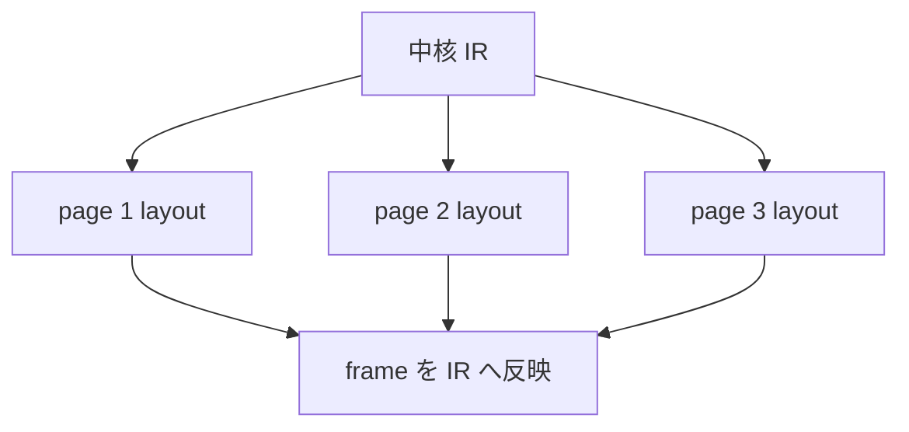

# 差分処理と並列処理

`ss` は，文書全体を一度に処理する実装から始まっていますが，現在の実装にも差分処理と並列処理へつなげる境界があります．現時点で実装されている依存情報，独立しやすい単位，注意点を扱います．

## 現在の単位

処理系で自然に分かれている単位は次の通りです．

| 単位 | 実装上の場所 | 並列化しやすさ |
| --- | --- | --- |
| モジュール読み込み | `src/modules` | import グラフに依存する |
| 関数表の収集 | `src/analysis/typecheck.zig` | モジュール単位で扱える |
| 型検査 | `src/analysis` | 関数やページ単位で分けられる余地がある |
| 展開の実行単位 | `ScheduledUnit` | 依存辺がない単位は並列化の候補 |
| ページ配置 | `src/layout` | ページ単位で独立しやすい |
| PDF 描画 | `src/render` | ページ単位またはアセット単位に分ける余地がある |

現在の実装は，これらをすべて並列実行している状態ではありません．依存情報とページ単位の境界は，今後の作業の基礎になります．

## 依存情報

展開前に，`src/analysis/dependencies.zig` が読み書き資源を集めます．

```zig
pub const ResourceKind = enum {
    graph_pages,
    graph_objects,
    property,
    content,
    metadata,
    constraints,
    render_env,
    diagnostics,
    layout,
    asset,
};
```

この情報は，document 文と page 本体の実行順序を決めるために使います．同じ文書グラフ資源に対して，片方が書き，もう片方が読む場合は，順序を固定します．

## 展開スケジュール

`src/elaboration/eval.zig` の `ScheduleGraph` は，実行単位と依存辺を持ちます．

```zig
const ScheduleGraph = struct {
    document: doc.Document,
    units: std.ArrayList(ScheduledUnit),
    edges: std.ArrayList(ScheduleEdge),
    order: []usize,
};
```

現在はトポロジカル順序を作り，その順に実行します．依存辺のない単位を同時実行するには，値環境，文書状態，診断，ID 採番，メタデータ採番の扱いを設計する必要があります．

## ページ配置

配置はページ単位で独立しやすい処理です．ページ内の object，制約，group，診断をまとめて扱い，別ページの frame を直接参照しません．



ページ番号，総ページ数，目次，フッターなどは展開段階でページ列を読みます．配置の並列化では，展開後のページ集合が固定されていることが前提になります．

## アセットと描画

画像，PDF，数式，Font Awesome は，描画時に外部コマンドやキャッシュを使うことがあります．これらは object 単位で独立しやすく，キャッシュディレクトリ，ファイル名，外部コマンドの一時ファイルが衝突しないようにする必要があります．

```text
.ss-cache/render
  asset cache
  math cache
  pdf page cache
```

キャッシュを並列化する場合は，入力内容から安定したキーを作り，同じ出力を複数プロセスが同時に作らないようにします．

## 差分処理の候補

差分処理では，変更された入力から再実行が必要な単位を決めます．

| 変更 | 影響範囲 |
| --- | --- |
| ページ本文の文字列 | そのページの展開，配置，描画 |
| 標準テーマの文字サイズ | 多くのページの配置と描画 |
| 生成関数 | document 文，関連ページ，生成 object |
| import 先の関数 | その関数を呼ぶページや document 文 |
| アセットファイル | 参照している object の配置見積もりと描画 |
| 描画器のコード | render 全体 |

現在の実装では，この影響範囲を永続キャッシュとしては保持していません．モジュール索引，依存資源，ページ単位の配置は，差分化のための情報になります．

## 注意点

並列化するときに壊れやすい箇所は次の通りです．

| 箇所 | 注意 |
| --- | --- |
| ID 採番 | 並列実行でも安定した順序を保つ必要がある |
| 診断順 | 出力順が毎回変わると利用者が読みづらい |
| document 文 | ページ集合やメタデータを読むため順序が処理結果に影響する |
| 文字列所有権 | アロケータと deinit の責務を明確にする |
| キャッシュ | 同じファイルへ同時に書かない |
| 外部コマンド | 一時ファイル名と環境変数を分離する |

スレッド数を増やす前に，実行単位と所有権を固定します．

## 実行例

現状の実装で差分や並列の内部状態を直接出すコマンドはありません．変更の影響を見るには，`dump` と render 出力を比較します．

```sh
ss dump slide.ss .ss-cache/before.json
ss render slide.ss .ss-cache/before.pdf
```

変更後に同じコマンドを実行し，`nodes`，`constraints`，`frame`，`diagnostics` の差分を見ます．

```sh
ss dump slide.ss .ss-cache/after.json
ss render slide.ss .ss-cache/after.pdf
```

## 参照

- 実行単位と依存辺は [展開](./elaboration) を参照してください．
- ページ単位の配置は [配置ソルバ](./layout-solver) を参照してください．
- 描画キャッシュと外部コマンドは [PDF 描画器](./pdf-backend) を参照してください．
