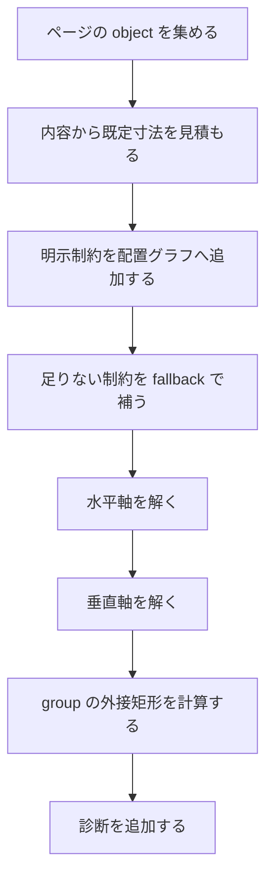

# 配置ソルバ

配置ソルバは，中核 IR の object と制約から各 object の矩形を決めます．実装は `src/layout` にあります．利用者向けの説明は [配置](../layout/default) と [制約](../authoring/constraints) を参照してください．

## 主なファイル

| ファイル | 担当 |
| --- | --- |
| `src/layout/root.zig` | ページごとの配置処理の入口 |
| `src/layout/graph.zig` | 配置グラフ，軸状態，制約，許容誤差 |
| `src/layout/solver.zig` | 水平軸と垂直軸の解決 |
| `src/layout/fallback.zig` | 明示制約が足りない場合の既定配置 |
| `src/layout/groups.zig` | group の外接矩形と子の平行移動 |
| `src/layout/metrics.zig` | 文字，コード，画像，PDF，数式の見積もり |
| `src/layout/style.zig` | プロパティから寸法や色を読む補助 |
| `src/layout/diagnostics.zig` | はみ出しや未解決 frame の診断 |

## 入力と出力

| 項目 | 内容 |
| --- | --- |
| 入力 | 正規化済みの `core.Ir` |
| 入力内の主な値 | `nodes`，`contains`，`constraints`，`properties`，`content` |
| 出力 | 各 object の `frame` |
| 診断 | 制約衝突，負の寸法，未解決 frame，ページはみ出し，内容はみ出し |

配置はページ単位で処理します．ページをまたいだ制約は現在のモデルにはありません．

## 配置グラフ

ページ内の object は，水平軸と垂直軸を別々に解きます．各軸には始点，終点，中心，サイズがあります．

```text
水平軸: left, right, center_x, width
垂直軸: top, bottom, center_y, height
```

`core.Constraint` はアンカー同士の等式として配置グラフへ入ります．ソルバは，制約と既定サイズを組み合わせて `Frame` を決めます．

```zig
pub const Frame = struct {
    x: f32,
    y: f32,
    width: f32,
    height: f32,
    x_set: bool,
    y_set: bool,
};
```

## 処理の流れ



既定寸法は，本文，コード，画像，PDF，数式，枠，パネルなどの種別とプロパティに依存します．描画器が最終的に描く値と完全に同一の測定ではありませんが，配置を安定させるための見積もりです．

## 制約の意味

制約は，target のアンカーを source のアンカーに offset 付きで合わせます．

```ss
~ body.top == title.bottom - 32
```

この形は，`body` の上端を `title` の下端から一定距離だけ離すために使います．標準ライブラリの `below`，`same_l`，`pin_l` などは，この低水準制約を作る補助関数です．

## 既定配置

すべての object に明示制約を書くと文書が長くなります．そのため，明示制約が足りない場合は `fallback.zig` が既定配置を補います．

| 既定配置の対象 | 説明 |
| --- | --- |
| ページ内の通常 object | 上から順に置く |
| 幅未指定の本文 | ページ幅と余白から幅を推定する |
| 高さ未指定の本文 | 内容から高さを見積もる |
| アセット | 画像や PDF の寸法と倍率から見積もる |
| overlay | 対象 object やプロパティから寸法を決める |

明示制約と既定配置が衝突した場合は，明示制約を優先し，解けない状態は診断になります．

## group

group は複数 object をまとめる object です．`groups.zig` は子 object の外接矩形を計算し，group の frame を決めます．group を移動する場合は，子 object も同じ量だけ平行移動します．

```ss
let a = text("A")
let b = text("B")
let g = group(a, b)
```

group は通常の描画 object と同じく `Node` ですが，`role` は `group`，`object_kind` は `overlay` です．

## 診断

配置で出る代表的な診断は次の通りです．

| 診断 | 説明 |
| --- | --- |
| `ConstraintConflict` | 同じ軸に矛盾する制約がある |
| `NegativeConstraintSize` | left と right，top と bottom から負のサイズが出る |
| `unresolved_frame` | 座標または寸法が決まらない |
| `page_overflow` | object がページ外へ出る |
| `content_overflow` | 内容に必要な高さが frame より大きい |

制約衝突では，`origin` を診断に出します．標準ライブラリ関数経由で作った制約でも，可能な限り元の `.ss` の位置を保つようにします．

## 実行例

配置を見るには `dump` が便利です．

```ss
import std:themes/default

page layout
let title = head("配置")
let body = text("本文")
below(body, title, 32)
same_l(body, title, 0)
end
```

```sh
ss dump slide.ss .ss-cache/layout.json
```

dump では `nodes` の `frame` と `constraints` を見ます．PDF では実際の重なりやはみ出しを確認します．

```sh
ss render slide.ss .ss-cache/layout.pdf
```

## 変更時の確認

配置を変更した場合は，少なくとも `check`，`dump`，`render` を確認します．

```sh
zig build
zig build test
zig build run -- dump demo/seminar-05-12.ss .ss-cache/layout-dump.json
zig build run -- render demo/seminar-05-12.ss .ss-cache/layout.pdf
```

本文の見積もり，コード，画像，PDF，数式，枠，group のいずれかを変えた場合は，該当コンポーネントのページも確認します．配置補助関数だけで表せる変更は，先に `stdlib/core` や `stdlib/themes` で扱えないかを確認します．
