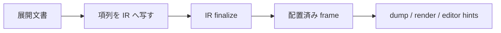

# 正規化

正規化は，展開で作られた `elaboration.Document` を [中核 IR](./core-ir) に反映する処理です．実装は `src/lowering/normalize.zig` にあります．この処理は，展開中の `HandleId` を中核 IR の `NodeId` に対応付け，ページ，object，メタデータ，制約，診断を順に追加します．

## 入口

`src/lowering/normalize.zig` の入口は `lowerToIr` です．

```zig
pub fn lowerToIr(ir: *core.Ir) !void {
    var code = try elaboration.elaborateIr(ir.allocator, ir);
    defer code.deinit();

    try normalizeDocumentCode(ir, &code);
    try ir.finalize();
    try editor.refreshSolvedFrameHints(ir.allocator, ir);
}
```

この関数は三つの処理をまとめています．

| 処理 | 内容 |
| --- | --- |
| `elaborateIr` | ユーザプログラムと標準ライブラリ関数を実行し，展開文書を作る |
| `normalizeDocumentCode` | 展開文書の項列を中核 IR に写す |
| `ir.finalize` | 配置解決や追加検証を行い，描画可能な状態にする |

CLI の進捗表示ではこの全体が `Lower and solve` として見えます．

## 正規化の入力

正規化が読む主な値は，展開文書の `terms` です．

```zig
for (code.terms.items) |term| {
    switch (term) {
        .add_page => ...,
        .make_node => ...,
        .add_containment => ...,
        .set_property => ...,
        .extend_render_env => ...,
        .set_content => ...,
        .add_metadata => ...,
        .add_constraint => ...,
        .materialize_fragment => {},
    }
}
```

正規化は展開文書の `nodes` を丸ごとコピーしません．展開中に記録された項を順に適用します．これにより，ページの作成，object の作成，親子関係，プロパティ設定，制約追加の順序が保たれます．

## ハンドル写像

展開中の識別子と中核 IR の識別子は別です．`NormalizeContext` は，この対応表を持ちます．

```zig
const NormalizeContext = struct {
    allocator: std.mem.Allocator,
    node_map: std.AutoHashMap(doc.HandleId, core.NodeId),
};
```

初期状態では，展開文書の `document_id` と中核 IR の `document_id` を対応させます．

```text
doc.document_id -> ir.document_id
```

その後，`add_page` や `make_node` が来るたびに，中核 IR 側で新しいノードを作り，対応表へ入れます．`set_property` や `add_constraint` は，対応表を使って展開ハンドルを中核 IR のノードへ変換します．

## 項ごとの写像

正規化では，項ごとに次の処理を行います．

| 展開文書の項 | 中核 IR への反映 |
| --- | --- |
| `add_page` | `ir.addPage` でページを追加し，ハンドル写像へ入れる |
| `make_node` | `ir.makeNodeFromStage` で object などを作り，写像へ入れる |
| `add_containment` | 親子ハンドルを `NodeId` に写し，`ir.addContainmentFromStage` を呼ぶ |
| `set_property` | ノードハンドルを写し，`ir.setNodeProperty` を呼ぶ |
| `extend_render_env` | ノードハンドルを写し，`ir.extendRenderEnv` を呼ぶ |
| `set_content` | ノードハンドルを写し，`ir.setNodeContent` を呼ぶ |
| `add_metadata` | ページハンドルを写し，`ir.addMetadata` を呼ぶ |
| `add_constraint` | 制約内の target と source を写し，`ir.constraints` に追加する |
| `materialize_fragment` | 現在は正規化で直接処理しない |

この写像は，展開文書が中核 IR と同じノード番号を持つことを前提にしません．ノード番号の一致に依存する実装を追加すると，import や生成順序の変化で壊れやすくなります．

## 制約の写像

配置制約には，対象ノード，対象アンカー，基準ノードまたはページアンカー，オフセットがあります．

```zig
pub const Constraint = struct {
    target_node: NodeId,
    target_anchor: Anchor,
    source: ConstraintSource,
    offset: f32,
    origin: ?[]const u8,
};
```

正規化では，`target_node` と `source.node.node_id` をハンドル写像で変換します．ページアンカーは特定ノードを持たないため，アンカー名だけを保ちます．

```text
展開制約:
  target_node = handle 8
  source = node handle 5 bottom

正規化後:
  target_node = NodeId 12
  source = node NodeId 9 bottom
```

`origin` はソース上の位置を示す文字列です．正規化時に中核 IR 側のアロケータへ複製します．制約衝突を報告するときは，この `origin` を使って該当箇所を表示します．

## 診断の写像

展開中に作られた診断も，中核 IR の診断へ写します．

```zig
fn mapDiagnostic(ir: *core.Ir, ctx: *NormalizeContext, diagnostic: core.Diagnostic) !core.Diagnostic
```

診断に含まれる `page_id` と `node_id` は，展開ハンドルから中核 IR の `NodeId` へ変換します．`asset_not_found` や `asset_invalid` のように文字列を持つ診断は，中核 IR 側へ文字列を複製します．

| 診断データ | 正規化時の扱い |
| --- | --- |
| `user_report` | メッセージを複製する |
| `asset_not_found` | 要求パス，解決後パス，ペイロード種別を複製する |
| `asset_invalid` | 理由とペイロード種別を複製する |
| `type_mismatch` | 値をそのまま写す |
| `recursive_function` | 関数名を複製する |
| `unresolved_frame` | 値をそのまま写す |
| `page_overflow` | 値をそのまま写す |
| `content_overflow` | 値をそのまま写す |

正規化は診断の意味を変更しません．所有権とノード番号を中核 IR 側に合わせます．

## finalize との関係

`normalizeDocumentCode` が終わった時点で，ページ，object，親子関係，プロパティ，制約，メタデータは中核 IR に入っています．その後の `ir.finalize` が，配置解決や追加検証を行います．



`frame` は `core.Node` に保持されます．配置解決後に，object の `x`，`y`，`width`，`height` が設定されます．エディタ用の solved frame hint は，`editor.refreshSolvedFrameHints` で更新します．

## 失敗しやすい箇所

正規化は単純なコピーに見えますが，次の不変条件があります．

| 不変条件 | 破ると起きること |
| --- | --- |
| 親を追加する前に子を参照しない | `UnknownNode` になる |
| `add_page` と `make_node` で作ったハンドルは必ず写像へ入れる | 後続のプロパティや制約が解決できない |
| `origin` は中核 IR 側へ複製する | ソース位置の参照が壊れる |
| 診断内のノード番号も写す | dump やエラー表示が別ノードを指す |
| 制約の source が page の場合はノード写像を使わない | ページアンカーを誤ってノード扱いする |

展開側で新しい `Term` を追加した場合は，必ず正規化にも対応を追加します．対応がない場合，dump と render に反映されません．

## 実行例

次の `.ss` は，ページ，object，プロパティ，制約を作ります．

```ss
import std:themes/default

page example
let title = head("正規化")
let body = text("本文")
body.text_size = 22
below(body, title, 32)
end
```

展開文書では，概念的には次の項列が作られます．

```text
add_page(example)
add_containment(document, example)
make_node(title)
add_containment(example, title)
make_node(body)
add_containment(example, body)
set_property(body, text_size, "22")
add_constraint(body.top, title.bottom, -32)
```

正規化はこの順序で中核 IR に反映します．確認には `dump` を使います．

```sh
ss dump slide.ss .ss-cache/lowering.json
```

dump では，`nodes`，`contains`，`constraints`，`diagnostics` を見ます．配置の結果を確認する場合は，`frame` が設定されているかを見ます．

## 変更時の確認

正規化を変更した場合は，次を確認します．

```sh
zig build
zig build test
zig build run -- dump demo/seminar-05-12.ss .ss-cache/lowering-dump.json
zig build run -- render demo/seminar-05-12.ss .ss-cache/lowering-render.pdf
```

ノード追加，親子関係，制約，診断，メタデータのいずれかを変えた場合は，dump JSON の該当フィールドを見ます．描画器でしか分からない破損もあるため，構造変更後は render も確認します．

## 参照

- 展開側の文書項は [展開](./elaboration) を参照してください．
- 中核 IR の構造は [中核 IR](./core-ir) を参照してください．
- 配置解決は [配置ソルバ](./layout-solver) を参照してください．
- 利用者向けの配置制約は [制約](../authoring/constraints) を参照してください．
