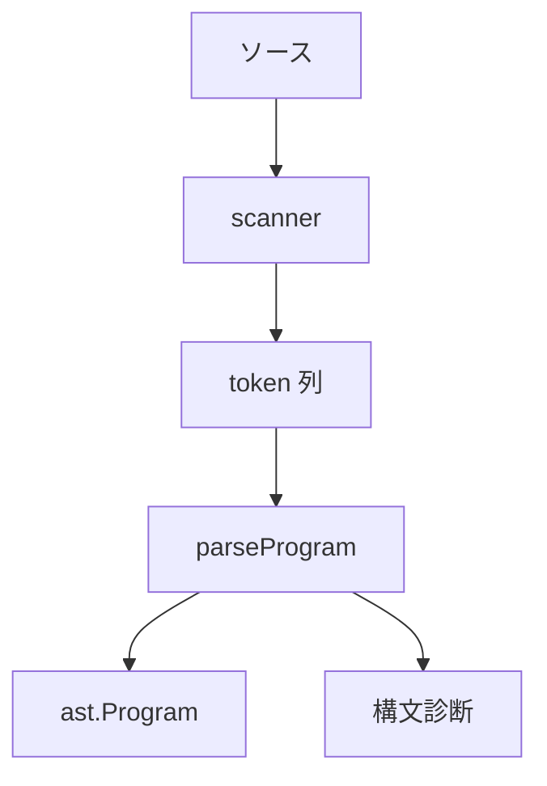

# パーサ

パーサは `.ss` のソース文字列から AST を作ります．実装は `src/syntax/scanner.zig`，`src/syntax/parse.zig`，`src/syntax/diagnostics.zig`，AST の定義は `src/ast.zig` にあります．利用者向けの構文は [構文](../authoring/syntax) を参照してください．

## 入口

公開されている入口は `parse` と `parseWithSourceName` です．

```zig
pub fn parse(allocator: Allocator, source: []const u8) !Program
pub fn parseWithSourceName(allocator: Allocator, source: []const u8, source_name: []const u8) !Program
```

CLI からは `src/app.zig` の `parseSource` を経由して呼ばれます．構文エラーがある場合は，ソース位置付きの診断を出して `DiagnosticsFailed` として扱います．

## 処理の流れ



scanner は文字列を token に分けます．parser は token 列を読み，関数，定数，型，object 宣言，import，document 文，page ブロック，式，制約を AST にします．

## AST の入口

`ast.Program` は，トップレベルの構造をまとめます．

```zig
pub const Program = struct {
    imports: std.ArrayList(ImportDecl),
    functions: std.ArrayList(FunctionDecl),
    constants: std.ArrayList(FunctionDecl),
    pages: std.ArrayList(PageDecl),
    document_statements: std.ArrayList(Statement),
    top_level_items: std.ArrayList(TopLevelItem),
};
```

`top_level_items` は，import と page のソース上の順序を保つために使います．展開ではこの順序を使い，import 済みモジュールとプロジェクトの page を処理します．

## トップレベル構文

パーサがトップレベルで読む主な構文は次の通りです．

| 構文 | AST | 説明 |
| --- | --- | --- |
| `import` | `ImportDecl` | モジュール指定 |
| `const` | `FunctionDecl` | 引数なし関数として扱う定数 |
| `fn` | `FunctionDecl` | 関数宣言 |
| `type` | `TypeItem` | 型や object クラスの宣言 |
| `object` | `ObjectDecl` | object クラスとメンバー |
| `extend object` | `ObjectExtensionDecl` | object クラスの拡張 |
| `document` | `document_statements` | 文書全体の文 |
| `page` | `PageDecl` | ページ本体 |

`document` は文の列として `Program.document_statements` に入ります．

## 文

文は `ast.Statement` です．

```zig
pub const Statement = struct {
    kind: Kind,
    span: Span,
};
```

主な文は，`let`，返り値，式文，プロパティ代入，制約，`if`，`for` 系の構文です．parser は文の先頭 token を見て分岐します．関数呼び出しとプロパティ代入は同じ識別子から始まるため，`parseMemberAssignmentStatement` などで後続 token を見て判定します．

## 式の優先順位

式パーサは，優先順位ごとに関数を分けています．

```text
parseExpr
  parseConcatExpr
    parseAddSubExpr
      parseMulDivExpr
        parseUnaryExpr
          parsePostfixExpr
            parsePrimaryExpr
```

対応は次の通りです．

| 関数 | 構文 |
| --- | --- |
| `parseConcatExpr` | `++` |
| `parseAddSubExpr` | `+`，`-` |
| `parseMulDivExpr` | `*`，`/` |
| `parseUnaryExpr` | 単項 `-` |
| `parsePostfixExpr` | 関数適用，プロパティ参照，内容参照 |
| `parsePrimaryExpr` | 識別子，文字列，数値，真偽値，括弧，ラムダ |

演算子表記は，構文解析後は組み込み関数の呼び出しと同じ形で扱います．たとえば `a + b` は `add(a, b)`，`a ++ b` は `concat(a, b)` と同じ関数呼び出しです．利用者向けの一覧は [演算子と組み込み関数](../authoring/operators-and-builtins) を参照してください．

## 文字列

文字列には，通常の引用符付き文字列，行テキスト，山括弧ブロックがあります．

```ss
text("一行")
text << 
複数行の本文
>>
```

`parseTextArg`，`parseLineText`，`parseChevronBlockString` がこの周辺を扱います．Markdown としての解釈はパーサでは行いません．Markdown 風の本文は中核モデルと描画器側で処理します．

## 制約構文

制約文は `~` で始まります．

```ss
~ body.top == title.bottom - 32
```

parser は，target 側の object とアンカー，source 側の object または page とアンカー，offset を AST にします．アンカー名の妥当性は後段の名前解決と展開で確認します．

## 型構文

型注釈は `parseTypeAnnotation` から読みます．

```ss
fn label(value: string, size: number) -> object
  return text(value)
end
```

関数型と `selection<T>` を扱います．型の意味は [値と型](../authoring/values-and-types) と [解析と型](./analysis) を参照してください．

## エラー位置

AST の主要要素は `Span` を持ちます．`Span` はソース文字列の byte 範囲です．エラー表示では，この byte 範囲を行と列へ変換します．

```zig
pub const Span = struct {
    start: usize,
    end: usize,
};
```

構文エラーで必要なのは，読者が直すべき最小範囲です．大きなブロック全体を指すより，欠けている `end`，不正な token，閉じていない文字列など，原因に近い範囲を指します．

## 実行例

パーサだけを直接使うコマンドは公開 CLI にはありません．通常は `check` で構文解析を通します．

```sh
ss check slide.ss
```

構文エラーの例です．

```ss
page intro
text("本文")
```

この場合は，`end` が不足しています．parser は page 本体の終端を読めず，構文診断を出します．

## 変更時の確認

構文を変えた場合は，parser の単体テスト，既存サンプル，標準ライブラリを確認します．

```sh
zig build test
zig build run -- check demo/seminar-05-12.ss
for f in stdlib/core/*.ss stdlib/themes/*.ss; do
  zig-out/bin/ss check "$f"
done
```

新しい構文を追加した場合は，構文ページにも例を追加します．演算子表記を追加した場合は，対応する関数名，優先順位，型，通常の関数呼び出しでの例を [演算子と組み込み関数](../authoring/operators-and-builtins) に追加します．
