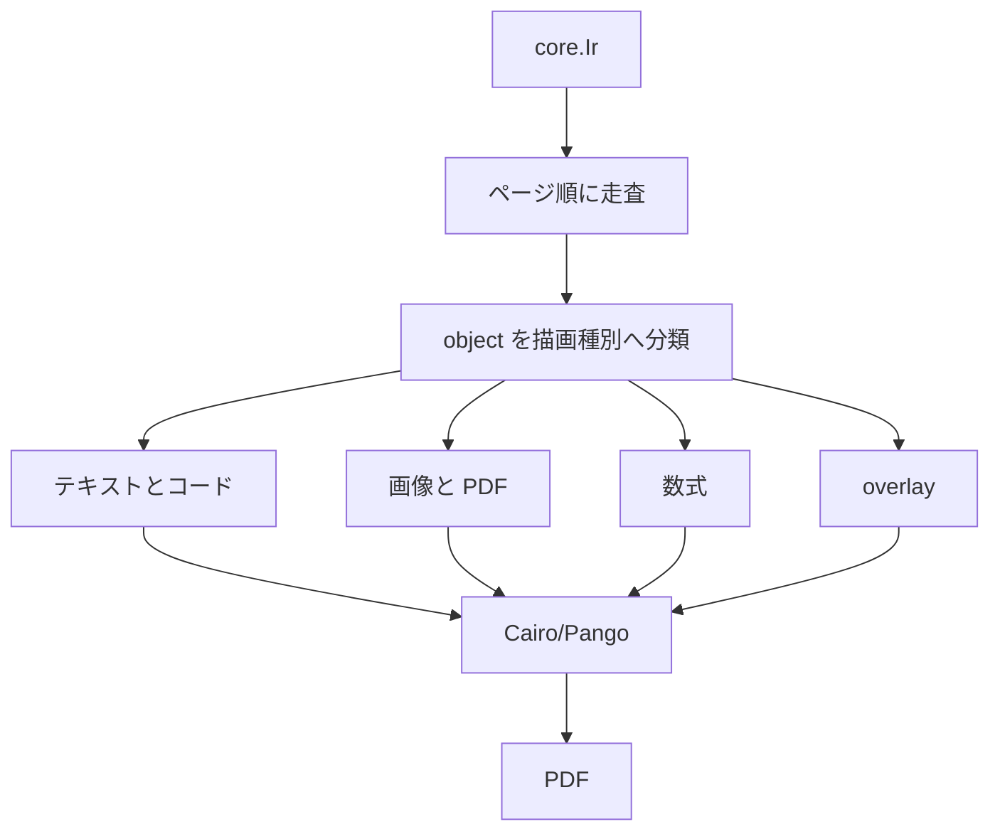

# PDF 描画器

PDF 描画器は，配置済みの中核 IR を読み，PDF を生成します．主な実装は `src/render/pdf.zig`，`src/render/pdf_native.zig`，Cairo/Pango との接続は `src/render/pdf_native_c.c` にあります．描画に必要な外部コマンドは [外部コマンド](../rendering/external-tools) を参照してください．

## 入力

描画器の入力は，配置済みの `core.Ir` です．ユーザ関数は描画時には再実行しません．描画器は，ページ順，object，frame，content，payload，properties，render env，asset_base_dir を読みます．



## 描画種別

描画器は，`object_kind`，`payload_kind`，`render_kind` プロパティなどを使って処理を選びます．

| 対象 | 主な入力 | 処理 |
| --- | --- | --- |
| 本文 | `payload_kind = text` | Markdown 風の本文を Pango へ渡す |
| コード | `payload_kind = code` | シンタックスハイライト後に描画する |
| LaTeX 数式 | `payload_kind = math_tex` | 外部コマンドで画像化して描画する |
| 画像 | `payload_kind = image_ref` | アセットパスを解決して描画する |
| PDF | `payload_kind = pdf_ref` | 指定ページを画像化して描画する |
| 枠や背景 | `object_kind = overlay` | 矩形，線，塗りを描画する |
| Font Awesome | `render_kind` など | アイコン名を解決して描画する |

Font Awesome の詳細は [Font Awesome](../rendering/fontawesome) を参照してください．数式は [数式](../rendering/math)，アセットは [アセット](../rendering/assets) を参照してください．

## プロパティ

描画器はプロパティを文字列として読み，必要な型へ変換します．

| プロパティ例 | 用途 |
| --- | --- |
| `text_size` | 文字サイズ |
| `text_line_height` | 行送り |
| `text_color` | 文字色 |
| `fill` | 背景色 |
| `stroke` | 線色 |
| `stroke_width` | 線幅 |
| `asset_scale` | アセット倍率 |
| `render_kind` | 特別な描画方式 |
| `font_family` | フォント指定 |

プロパティ値は中核 IR では文字列ですが，ユーザコードでは数値や真偽値を代入できます．変換の詳細は [プロパティとスタイル](../authoring/properties) と [展開](./elaboration) を参照してください．

## 外部コマンド

描画の一部は外部コマンドに依存します．

| 用途 | 例 |
| --- | --- |
| SVG 変換 | `rsvg-convert` |
| PDF ページ画像化 | `pdftoppm` |
| 画像変換 | `magick` |
| LaTeX 数式 | `pdflatex` |
| PDF 正規化 | `qpdf` |

`ss check` は描画器を呼ばないため，外部コマンドの問題は `ss render` で確認します．

## アセット解決

アセットパスは `asset_base_dir` を基準に解決します．相対パスは `.ss` ファイルまたはプロジェクト設定の基準ディレクトリに対して扱います．存在しないアセットは `asset_not_found` 診断になります．

```ss
image("assets/plot.png", 0.8)
pdf("assets/report.pdf", 1, 0.7)
```

描画器は，アセットの種類ごとに寸法を取得し，配置済みの frame に合わせて描画します．配置段階の寸法見積もりと描画段階の実際の描画が大きくずれる場合は，はみ出しや重なりの原因になります．

## 文字描画

本文と見出しは Pango を通して描画します．Markdown 風の解釈は `src/core/markdown.zig` の結果を使います．文字サイズ，行送り，色，折り返し，太字，斜体などは，プロパティと Markdown 解析結果を組み合わせます．

絵文字やアイコンは，フォントや fallback の影響を受けます．文字と次の文字が近すぎる場合は，描画側で字形の幅や追加間隔を確認します．

## 診断

描画器は，描画時にしか分からない問題を診断します．

| 診断 | 例 |
| --- | --- |
| アセット不足 | 画像や PDF が存在しない |
| アセット不正 | 読めない画像，壊れた PDF |
| 外部コマンド失敗 | `pdflatex` や `pdftoppm` が失敗する |
| 内容はみ出し | frame より本文やコードの高さが大きい |
| Font Awesome 解決失敗 | アイコン名や接頭辞が見つからない |

描画診断は PDF を生成する途中で出るため，`check` で再現しないことがあります．描画に関係する不具合では，`render` の出力と `.ss-cache/` の中間生成物を確認します．

## 実行例

```sh
ss render slide.ss .ss-cache/out.pdf
```

開発中は，代表ファイルを render し，生成 PDF を開いて確認します．

```sh
zig build run -- render demo/seminar-05-12.ss .ss-cache/pdf-backend.pdf
```

アセットや数式を含む変更では，該当 object を含む最小の `.ss` を作って render すると原因を切り分けやすくなります．

## 変更時の確認

描画器を変更した場合は，構造と見た目の両方を確認します．

```sh
zig build
zig build test
zig build run -- render demo/seminar-05-12.ss .ss-cache/render.pdf
```

Font Awesome，絵文字，コードハイライト，PDF 埋め込み，数式，画像変換を触った場合は，それぞれを含むサンプルを render してください．生成物は `.ss-cache/` に置きます．
