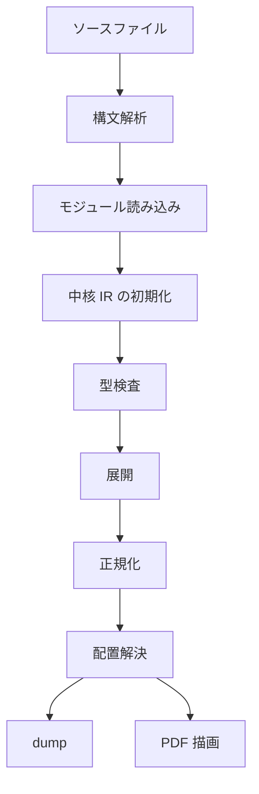

# コンパイラの流れ

`ss` の処理系を変更するときは，入力ファイルがどの順で内部表現へ変換され，どの段階で診断が出るかを先に見ます．構文の詳細は [構文](../authoring/syntax)，値と型は [値と型](../authoring/values-and-types)，演算子は [演算子と組み込み関数](../authoring/operators-and-builtins) を参照してください．

## 実行単位

CLI の入口は `src/main.zig` です．`check`，`dump`，`render` はいずれも `src/app.zig` のビルド処理を通ります．`render` だけが最後に PDF 描画器を呼びます．

| コマンド | 主な目的 | 到達する処理 |
| --- | --- | --- |
| `ss check input.ss` | 構文，読み込み，型，展開，配置の診断を見る | `app.buildFile` |
| `ss dump input.ss out.json` | 中核 IR，ページ，object，制約，診断を見る | `app.buildFile` の後に `dump` |
| `ss render input.ss out.pdf` | PDF を生成する | `app.buildFile` の後に `render/pdf.zig` |

`check` は描画器を呼びません．外部コマンド，画像変換，PDF 埋め込み，Font Awesome 画像化などを含む確認は `render` で行います．

## 全体の流れ

現在の実装では，処理は次の順に進みます．古い設計メモの段階名では説明しません．ユーザコードを文書グラフへ実行する処理は `src/elaboration`，その文書グラフを中核 IR へ写す処理は `src/lowering` にあります．



| 段階 | 実装 | 入力 | 出力 |
| --- | --- | --- | --- |
| ソース読み込み | `src/app.zig` | ファイルパス，アセット基準ディレクトリ | ソース文字列 |
| 構文解析 | `src/syntax` | ソース文字列 | `ast.Program` |
| モジュール読み込み | `src/modules`，`src/analysis/typecheck.zig` | import 指定，標準ライブラリ，プロジェクト | `ProgramIndex` |
| 初期 IR 構築 | `src/analysis/typecheck.zig` | AST とモジュール一覧 | `core.Ir` |
| 型検査 | `src/analysis` | `core.Ir` と AST | 診断，型情報，エディタ情報 |
| 展開 | `src/elaboration` | 型検査済み IR | `elaboration.Document` |
| 正規化 | `src/lowering` | `elaboration.Document` | ページ，ノード，制約を持つ `core.Ir` |
| 配置解決 | `src/core/ir.zig`，`src/layout` | `core.Ir` | 矩形，配置診断 |
| 描画 | `src/render` | 配置済み IR | PDF |

## `app.buildFile` の処理

`src/app.zig` の `buildFileWithAssetBaseAndOverlay` が中心です．処理の順序はコード上でも明確に並んでいます．

```text
read source
parseSource
loadProgramIndexWithOverlay
typecheck.buildIr
typecheck.typecheckProgram
lowering.lowerToIr
print diagnostics
return core.Ir
```

この関数は `progress` を受け取ると，`Read source`，`Parse`，`Load index`，`Typecheck`，`Lower and solve` の進捗を出します．名前は利用者向けの表示であり，内部では `Lower and solve` の中に展開，正規化，IR finalize，配置解決，エディタ用矩形ヒント更新が含まれます．

## 表現の変換

各段階で扱うデータは次のように変わります．

| 表現 | 主な構造 | 用途 |
| --- | --- | --- |
| ソース | `[]const u8` | エラー位置と文字列リテラルの基準 |
| AST | `ast.Program` | 構文木，import，関数，定数，ページ，document 文 |
| プログラム索引 | `ProgramIndex` | 解決済み import，関数表，関数の所属モジュール |
| 初期 IR | `core.Ir` | モジュール，関数，定義位置，型情報，文書ノード |
| 展開文書 | `elaboration.Document` | 実行結果としてのページ，ノード，メタデータ，制約，項列 |
| 中核 IR | `core.Ir` | dump，配置，描画が読むグラフ |
| 配置グラフ | `layout.LayoutGraph` | ページごとの水平軸，垂直軸，制約，既定配置 |

展開文書と中核 IR は似ていますが，用途が違います．展開文書はユーザ関数を実行しながら作る一時的な状態です．中核 IR は最終的に dump，配置，描画，エディタ機能が共有する状態です．

## 代表的なデータ構造

処理全体を追うときは，次の構造を起点にします．

```zig
pub const Ir = struct {
    modules: std.ArrayList(SourceModule),
    functions: std.StringHashMap(ast.FunctionDecl),
    variable_types: std.StringHashMap(SemanticSort),
    nodes: std.ArrayList(Node),
    metadata: std.ArrayList(Metadata),
    page_order: std.ArrayList(NodeId),
    contains: std.AutoHashMap(NodeId, std.ArrayList(NodeId)),
    constraints: std.ArrayList(Constraint),
    diagnostics: std.ArrayList(Diagnostic),
};
```

```zig
pub const Document = struct {
    nodes: std.ArrayList(core.Node),
    metadata: std.ArrayList(core.Metadata),
    page_order: std.ArrayList(HandleId),
    contains: std.AutoHashMap(HandleId, std.ArrayList(HandleId)),
    constraints: std.ArrayList(core.Constraint),
    diagnostics: std.ArrayList(core.Diagnostic),
    terms: std.ArrayList(Term),
};
```

`Ir` は読み込み後から描画まで残ります．`Document` は展開と正規化の間だけ使います．`Document.terms` は，展開中に起きた操作を順番付きの項として残し，正規化時に `Ir` へ写すために使います．

## 診断の流れ

診断は段階ごとに扱いが違います．

| 段階 | 例 | 出力方法 |
| --- | --- | --- |
| 構文解析 | 閉じ忘れ，未知のトークン | ソース位置を直接出す |
| import 解決 | 存在しない `std:` モジュール，循環 import | `modules/loader.zig` の報告 |
| 型検査 | 型不一致，未知の関数，不正な返り値 | `core.Ir.diagnostics` |
| 展開 | 不正な引数，ページ外での page 操作 | ソース位置付きの下位診断 |
| 正規化 | 不明なハンドル，制約写像の失敗 | IR 診断または内部エラー |
| 配置 | 制約衝突，負の寸法，はみ出し | `ConstraintFailure` と `Diagnostic` |
| 描画 | アセット不足，外部コマンド失敗 | 描画器の診断またはコマンド失敗 |

`app.buildFile` は型検査後と正規化後に診断を確認します．エラーがある場合は `error.DiagnosticsFailed` を返します．制約衝突と負の寸法は，`printConstraintFailure` で原因を出します．

## import と標準ライブラリ

`import std:themes/default` のような import は，モジュール読み込みで解決されます．プロジェクトのファイル，`stdlib/core`，`stdlib/themes` は同じ AST と同じ関数表に入ります．ライブラリモジュールは，利用者ページを生成するためのコンポーネントを提供する側として扱われます．

```ss
import std:themes/default

page intro
head("題名")
text("本文")
end
```

この例では，`head` と `text` は標準テーマから関数として解決されます．ページブロックの実行時に，標準ライブラリ関数が現在ページへ object を追加します．

## 実行例

処理の各段階を見るには，`check`，`dump`，`render` を分けて使います．

```sh
zig build run -- check demo/seminar-05-12.ss
zig build run -- dump demo/seminar-05-12.ss .ss-cache/dev-dump.json
zig build run -- render demo/seminar-05-12.ss .ss-cache/dev-render.pdf
```

標準ライブラリを変更した場合は，標準ライブラリだけを検査します．

```sh
for f in stdlib/core/*.ss stdlib/themes/*.ss; do
  zig-out/bin/ss check "$f"
done
```

描画まで含めた確認では，`.ss-cache/` の下に PDF，画像，JSON を置きます．リポジトリのソースディレクトリには生成物を置きません．

## 変更箇所の選び方

構文そのものを変える場合は `src/syntax` と `src/analysis` を見ます．型や関数契約を変える場合は `src/language` と `src/analysis` を見ます．ユーザコードの実行結果を変える場合は `src/elaboration` を見ます．展開後の文書グラフを描画用 IR へ写す処理を変える場合は `src/lowering` を見ます．

コンポーネント，テーマ，配置補助，描画プロパティは，`stdlib/` 側で表せるかを先に見ます．標準ライブラリで表せる機能を中核プリミティブへ移すと，型検査，展開，正規化，描画の複数箇所に影響が広がります．

## 参照

- 構文の実装は [パーサ](./parser) を参照してください．
- 型検査と関数契約は [解析と型](./analysis) を参照してください．
- ユーザ関数の実行は [展開](./elaboration) を参照してください．
- 文書項から IR への写像は [正規化](./lowering) を参照してください．
- グラフのデータ構造は [中核 IR](./core-ir) を参照してください．
- ページ内の矩形計算は [配置ソルバ](./layout-solver) を参照してください．
